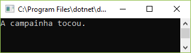
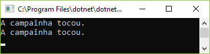
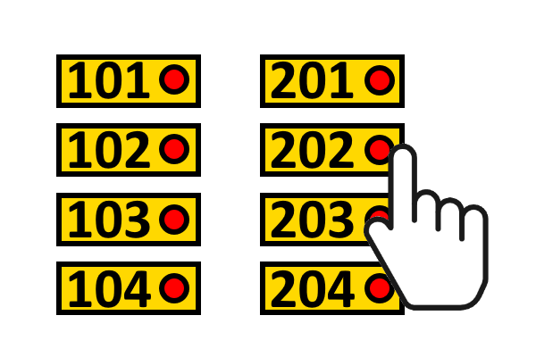

# Criar e implementar enventos e callbacks

Vamos começar o curso com um uma simples classe chamada `Campainha`, cuja
única função é tocar. 


```csharp
class Campainha
{
    public void Tocar()
    {
        Console.WriteLine("A campainha tocou.");
    }
}
```

Então criamos um programa simples para utilizar essa classe:

```csharp
class Program
{
    static void Main(string[] args)
    {
        Campainha campainha = new Campainha();
        campainha.Tocar();
        Console.ReadKey();
    }
}
```

Note como a execução do programa segue uma ordem sequencial:

1. Vamos criar um programa que instanciando essa classe
2. Em seguida, tocamos a campainha, chamando o método da classe
3. Depois, esperamos o usuário teclar algo

Até aqui, você viu que a execução de um programa avança de instrução para
declaração, processando os dados de acordo com o
declarações que são executadas. Na computação tradicional,
o programa flui do início ao fim, começando
com os dados de entrada e produzindo alguma saída antes
de terminar. 

Agora imagine que você precise executar um código dentro da classe `Program`,
que será chamado sempre que o método `Campainha`, no lugar do pseudocódigo abaixo:

```csharp
static void Main(string[] args)
{
    Campainha campainha = new Campainha();
    
    //pseudocódigo
    //SE A CAMPAINHA TOCAR, EXECUTE
    //    Console.WriteLine("A campainha tocou.");

    campainha.Tocar();
    Console.ReadKey();
}
```

Como podemos ver, isso quebrará a execução sequencial, pois o novo código deverá
ser executado antes da linha seguinte à chamada do método `Tocar()`.

Por isso, aplicações modernas possuem fluxos que
funcionam de maneira diferente da computação tradicional. 
Grande aplicações envolvem componentes que se comunicam através 
de mensagens, e isso produz um fluxo que foge da execução sequencial
(linha-a-linha).

Para criar soluções que funcionem dessa maneira,
precisamos de um mecanismo pelo qual um componente possa
enviar mensagens para outro. Com a linguagem C#, podemos realizar isso
através dos **eventos**.

**Delegado de ação**

O pseudocódigo acima precisa é de algum tipo de "gancho" que seja chamado assim
que o método `Tocar` da classe `Campainha` seja chamado.

Em outras palavras, o método `Tocar` precisa "delegar uma ação", isto é, entregar
o controle da execução para o pseudocódigo que queremos criar na classe `Program`.

Mas a classe Campainha não sabe nada sobre a classe Program. Então como podemos
fazer essa comunicação? Aqui entra o **delegado de ação**.

A classe Campainha vai **expor** uma propriedade que pode ou não ser usada pelos
seus clientes. Essa propriedade é um **delegado de ação**, ou `Action`. Vamos
chamar essa action de `OnCampainhaTocou`:

```csharp
class Campainha
{
    public Action OnCampainhaTocou { get; set; }

    public void Tocar()
    {
        Console.WriteLine("A campainha tocou.");
    }
}
```

E como fazemos para essa `action` ser executada?

```csharp
public void Tocar()
{
    OnCampainhaTocou();
}
```

Note que `OnCampainhaTocou` é executado como um método. Por quê? Porque é realmente um método.
Melhor dizendo, podemos pensar num delegado de ação como um **ponteiro para um método**.

Quando executamos o código neste momento, tomaremos uma **exceção de referência nula**. Mas por quê?

Acontece que `OnCampainhaTocou` é ma propriedade que armazena um **tipo de referência**.
Como ela nunca foi inicializada, a chamada na linha `OnCampainhaTocou();` lança uma exceção de referência nula.

Por isso, temos que tomar cuidado: antes de executar a action, é preciso ver se ela foi incializada:

```csharp
public void Tocar()
{
    if (OnCampainhaTocou != null)
    {
        OnCampainhaTocou();
    }
}
```

E agora, para consumir a action, vamos adicionar 2 métodos à classe Program,
que não fazem nada além de escrever uma mensagem no console:

```csharp
class Program
{
    static void CampainhaTocou1()
    {
        Console.WriteLine("A campainha tocou.");
    }
```

Falta ainda "amarrar" esses métodos como a action da classe `Campainha`.

Associamos um método existente com a propriedade "action" da `OnCampainhaTocou`
com o operador **+=** :

```csharp
Campainha campainha = new Campainha();
campainha.OnCampainhaTocou += CampainhaTocou1;
```

Rodando a aplicação, temos a mensagem:



Podemos pensar na action OnCampainhaTocou como um **"evento"**.

Como vimos, um delegado de ação permite à classe Campainha executar um código que
está numa classe externa (Program), que a classe Campainha não precisa conhecer.

Outra característica de uma propriedade action é que ela pode ser associada a mais
de um método. Vamos comprovar isso criando mais um método na classe programa:

```csharp
static void CampainhaTocou2()
{
    Console.WriteLine("A campainha tocou.");
}
```

A agora basta associar a action também a esse novo método

```csharp
Campainha campainha = new Campainha();
campainha.OnCampainhaTocou += CampainhaTocou1;
campainha.OnCampainhaTocou += CampainhaTocou2;
```

Rodando a aplicação novamente, temos



Como vimos, ambos os métodos associados foram executados após o método `Tocar()` invocar a action.

As bibliotecas .NET fornecem um número pré-definido de
tipos de delegados. O delegado de ação mais simples
representa uma referência a um método que não
retornar um resultado (o método é do tipo void) e
não aceita nenhum parâmetro (Como os métodos CampainhaTocou1() e CampainhaTocou1()).

Abaixo, temos o código completo do programa:

```csharp
using System;

namespace _01_02
{
    class Program
    {
        static void CampainhaTocou1()
        {
            Console.WriteLine("A campainha tocou.");
        }

        static void CampainhaTocou2()
        {
            Console.WriteLine("A campainha tocou.");
        }

        static void Main(string[] args)
        {
            Campainha campainha = new Campainha();
            campainha.OnCampainhaTocou += CampainhaTocou1;
            campainha.OnCampainhaTocou += CampainhaTocou2;

            campainha.Tocar();
            Console.ReadKey();
        }
    }

    class Campainha
    {
        public Action OnCampainhaTocou { get; set; }

        public void Tocar()
        {
            if (OnCampainhaTocou != null)
            {
                OnCampainhaTocou();
            }
        }
    }
}
```

**Inscritos no evento**

Os "assinantes" de um "publicador de evento" (como a action OnCampainhaTocou) 
se ligam a um editor usando o operador **+=**. O operador `+=` é uma sobrecarga para aplicar um comportamento
a um delegado.

Você pode simplificar a chamada do delegado usando
o operador condicional nulo. Isso só executa uma
ação se o item especificado não for nulo.

```csharp
//if (OnCampainhaTocou != null)
//{
//    OnCampainhaTocou();
//}

OnCampainhaTocou?.Invoke();
```

O operador condicional nulo `.?` Significa 
"acesse este membro da classe `OnCampainhaTocou` somente se a referência não for
nula."

Um delegado expõe um método Invoke para
invocar os métodos ligados ao delegado. o
O comportamento do código é o mesmo porém o código fica mais curto e 
mais claro.

**Cancelar inscrição de um delegado**

Como aprendemos, o operador += foi sobrecarregado
para permitir que métodos se liguem a eventos.

Mas e se quisermos desassociar o método? Podemos "cancelar a inscriçaõ"
de um delegado facilmente, utilizando o operador `-=`.

Isso desvincula um dos métodos, mantendo o outro que já estava associado.

```csharp
static void Main (string [] args)
{
    Campainha campainha = new Campainha();
    campainha.OnCampainhaTocou += CampainhaTocou1;
    campainha.OnCampainhaTocou += CampainhaTocou2;
    Console.WriteLine("Chamando campainha.Tocar()");
    campainha.Tocar();
    campainha.OnCampainhaTocou -= CampainhaTocou1;
    Console.WriteLine("Chamando campainha.Tocar()");
    campainha.Tocar();
    Console.ReadKey();
}
```

Este programa gera o seguinte:

```
Chamando campainha.Tocar()
A campainha tocou.
A campainha tocou.
Chamando campainha.Tocar()
A campainha tocou.
```

Isso significa que um método pode ser associado e desvinculado, e associado
novament mais tarde, assim como desejarmos.

**Usando eventos**

Vamos dar uma olhada na propriedade *OnCampainhaTocou*:

```csharp
class Campainha
{
    public Action OnCampainhaTocou { get; set; }
    ...
}
```

Qual o problema com essa propriedade? Uma falha de **segurança**.

Como o delegado do OnCampainhaTocou é **público**, para que 
os assinantes possam se conectar a ele. Porém, isso significa 
que o código externo para o objeto Campainha pode tocar a campainha 
**diretamente**, chamando o delegado OnCampainhaTocou, por exemplo:

```csharp
Campainha campainha = new Campainha();
campainha.Tocar();
```

Isso não é desejável.

Além disso, algum código externo pode **sobrescrever** o valor de OnCampainhaTocou,
potencialmente removendo assinantes da action:

```csharp
campainha.OnCampainhaTocou = new Action(() => { });
```

E issso não é desejável.

C# fornece uma construção de evento que permite uma
delegado a ser especificado como um **evento**. 

```csharp
class Campainha
{
    public event Action OnCampainhaTocou = delegate { };
    public void Tocar()
    {
        OnCampainhaTocou();
    }
}
```

A palavra-chave **evento** tem que ser adicionada **antes** do
definição do delegado.

> public **event** Action OnCampainhaTocou = **delegate { };**

O membro `OnCampainhaTocou` agora é criado como um **campo** na
classe `Campainha`, em vez de uma propriedade.

Note que agora OnCampainhaTocou não tem mais os comportamentos get ou set.

Isso permiter **ocultar** esse evento **contra um acesso direto** de fora da classe Campainha.
Agora não é possível para o código
externo à classe Campainha atribuir valores a
OnCampainhaTocou. Esse delegate só pode ser chamado de dentro da classe
onde é declarado. Em outras palavras, adicionando a palavra-chave do evento
transforma um **delegado** em um **evento**.

**Criar eventos com tipos de delegação internos**

A próxima alteração exige a troca do tipo Action pelo tipo EventHandler:

```csharp
public event EventHandler OnCampainhaTocou = delegate { };
```

Programas que trabalham com eventos devem usar o
EventHandler Class em vez de Action.

Isto ocorre porque a classe EventHandler é a parte do .NET
projetado para permitir que os assinantes recebam dados sobre
um evento. EventHandler é usado em todo o
.NET framework para gerenciar eventos, e serve para fornecer dados, ou sinalizar
que um evento ocorreu. 

Agora vamos chamar o evento OnCampainhaTocou dentro do método Tocar(), mas de outra forma:

```csharp
public void Tocar()
{
    OnCampainhaTocou(this, EventArgs.Empty);
}
```

Como o evento OnCampainhaTocou já foi inicializado, agora não há 
necessidade de verificar se o delegado tem ou não um valor
antes de chamá-lo. Isso simplifica o método `Tocar()`.

Neste ponto, nossa classe Campainha possui o seguinte código:

```csharp
class Campainha
{
    public event EventHandler OnCampainhaTocou = delegate { };
    public void Tocar()
    {
        OnCampainhaTocou(this, EventArgs.Empty);
    }
}
```

O delegado **EventHandler** OnCampainhaTocou aceita dois argumentos. 

- O primeiro argumento é uma referência ao objeto que gera o evento.
- O segundo argumento é uma referência a um objeto de tipo EventArgs que fornece informações sobre oevento.

Note que o segundo argumento é definido
para um EventArgs vazio (empty), para indicar que esse evento
não produz nenhum dado, é simplesmente uma notificação
de que um evento ocorreu.

```csharp
OnCampainhaTocou(this, EventArgs.Empty);
```

Agora, as assinaturas dos métodos a serem adicionados a este
delegado devem refletir isso.

```csharp
static void CampainhaTocou1(object sender, EventArgs e)
{
    Console.WriteLine("A campainha tocou.");
}

static void CampainhaTocou2(object sender, EventArgs e)
{
    Console.WriteLine("A campainha tocou.");
}
```

Somente após essas alterações, os método CampainhaTocou1 e CampainhaTocou2 
aceita dois parâmetros e pode ser usado com este delegado.

**Use EventArgs para entregar informações sobre eventos**

A classe Campainha permite que um
assinante receba uma notificação de que um evento de campainha
foi gerado, mas não fornece ao assinante
qualquer descrição do evento.

Agora imagine uma campainha do mundo real, onde você tem um sistema
de porteiro eletrônico de um prédio, que permite acionar a campainha de um 
apartamento específico.



Seria útil se os assinantes pode receber informações sobre a 
campainha, como por exemplo, o número do apartamento.

Você pode fazer isso criando uma classe que possa entregar
esta informação (do número do apartamento) e, em seguida, 
usar um EventHandler para fornecer a informação.

Vamos criar então uma subclasse customizada a partir da classe `EventArgs`:

```csharp
class CampainhaEventArgs : EventArgs
{
    public string Apartamento { get; set; }
    public CampainhaEventArgs(string apartamento)
    {
        Apartamento = apartamento;
    }
}
```

Note que agora temos:

- Uma propriedade Apartamento
- um construtor que alimenta essa propriedade

Você pode adicionar mais informações, conforme necessário.

Agora você tem seu próprio tipo que pode ser usado para
descreve um evento que ocorreu. 

Como usar a nova classe CampainhaEventArgs em nossa aplicação?

Vamos começar trocando o tipo EventHandler (que por padrão trabalha com EventArgs)
por um EventHandler genérico: `EventHandler<CampainhaEventArgs>`

```csharp
public event EventHandler<CampainhaEventArgs> OnCampainhaTocou = delegate { };
```

Quando a campainha é tocada pelo método Tocou, o evento
é uma referência à campainha e um recém-criado
instância de CampainhaEventArgs que descreve o
evento de campainha.

Vamos modificar também o método Tocar(), para receber o número do apartamento,
e passar esse número para o objeto CampainhaEventArgs, que será o responsável por transportar essa informação
até os clientes assinantes.

```csharp
class Campainha
{
    public event EventHandler<CampainhaEventArgs> OnCampainhaTocou = delegate { };
    public void Tocar(string apartamento)
    {
        OnCampainhaTocou(this, new CampainhaEventArgs(apartamento));
    }
}
```

Outra modificação necessária é adequar os assinantes do evento para que
eles possam ser associados ao evento:

```csharp
static void CampainhaTocou1(object sender, CampainhaEventArgs e)
{
    Console.WriteLine($"A campainha tocou no apartamento {e.Apartamento}.");
}
```

Dessa forma, podemos exibir a informação completa: quando uma campainha foi acionada,
e também para qual apartamento.

**Exceções nos assinantes do evento**

Agora você sabe como os eventos funcionam. Vários
programas podem se inscrever em um mesmo evento. Eles fazem isso
vinculando um delegado ao evento. O delegado serve como
uma referência a **um trecho de código C#** que o assinante
quer executar quando o evento acontece. Este trecho de
código é chamado de **manipulador de eventos** (ex.: o método CampainhaTocou1).

Nos nossos programas de exemplo, o evento é uma campainha
sendo acionada. Quando a campainha é tocada, o evento
chamará **todos os manipuladores de eventos** que se inscreveram
o evento de campainha (os métodos CampainhaTocou1 e CampainhaTocou2). 

Mas o que acontece se um dos eventos
manipuladores falhar, lançando uma exceção?

Se o código em um dos assinantes lançar uma **exceção não identificada**,
o processo de tratamento de exceção **termina** nesse ponto e
nenhum outro assinante será notificado.
Isso não é nada bom, pois significa que alguns assinantes não seriam notificados.

Para resolver esse problema, cada manipulador de eventos pode ser
**chamado individualmente** e, em seguida, um único agregado
exceção criada Que contém todos os detalhes de qualquer
exceções que foram lançadas pelos manipuladores de eventos.

Como podemos implementar esse novo algoritmo?

Em primeiro lugar, vamos refatorar o método Tocar() para criar uma lista de exceções
que precisam ser tratadas:

```csharp
public void Tocar(string apartamento)
{
    List<Exception> listaExcecoes = new List<Exception>();
}
```

O segundo passo é obter a lista de assinantes.
Usamos o método GetInvocationList para obter uma lista de assinantes do evento.
Vamos criar um laço e iterar sobre a lista de manipuladores dos assinantes do evento OnCampainhaTocou.

```csharp
public void Tocar(string apartamento)
{
    List<Exception> listaExcecoes = new List<Exception>();
    foreach (Delegate handler in OnCampainhaTocou.GetInvocationList())
    {
    }
}
```

Para executar cada um dos delegados, é necessário invocar o método DynamicInvoke da classe Delegate.

Fazemos isso passando como argumentos:

- o objeto Campainha onde ocorreu o evento
- um novo objeto CampainhaEventArgs com informações sobre o apartamento

```csharp
public void Tocar(string apartamento)
{
    List<Exception> listaExcecoes = new List<Exception>();
    foreach (Delegate handler in OnCampainhaTocou.GetInvocationList())
    {
        handler.DynamicInvoke(this, new CampainhaEventArgs(apartamento));
    }
}
```

Mas até agora, não temos nenhum código para tratar as exceções. Vamos introduzir um bloco try-catch
para capturar erros e adicioná-los à lista exceptionList quando necessário.

```csharp
public void Tocar(string apartamento)
{
    List<Exception> listaExcecoes = new List<Exception>();
    foreach (Delegate handler in OnCampainhaTocou.GetInvocationList())
    {
        try
        {
            handler.DynamicInvoke(this, new CampainhaEventArgs(apartamento));
        }
        catch (TargetInvocationException e)
        {
            listaExcecoes.Add(e.InnerException);
        }
    }
}
```

Ao final do método, temos que verificar se alguma exceção foi adicionada à lista.
Se houver erros na lista, ela é usada para lançar uma nova exceção, do tipo "exceção agregada".

```csharp
public void Tocar(string apartamento)
{
    List<Exception> listaExcecoes = new List<Exception>();
    foreach (Delegate handler in OnCampainhaTocou.GetInvocationList())
    {
        try
        {
            handler.DynamicInvoke(this, new CampainhaEventArgs(apartamento));
        }
        catch (TargetInvocationException e)
        {
            listaExcecoes.Add(e.InnerException);
        }
    }

    if (listaExcecoes.Count > 0)
        throw new AggregateException(listaExcecoes);
}
```

Note que o código acima permite que todos os assinantes recebam notificações, mesmo se alguns
deles lançar uma exceção.

E quanto ao código cliente?

Agora falta preparar a classe Program para simular e lidar com exceções.

Vamos provocar exceções deliberadamente, em cada um dos manipuladores de evento:

```csharp
static void CampainhaTocou1(object source, CampainhaEventArgs e)
{
    Console.WriteLine("método CampainhaTocou1() foi chamado");
    Console.WriteLine("Apartamento: {0}", e.Apartamento);
    throw new Exception("Erro em CampainhaTocou1");
}

static void CampainhaTocou2(object source, CampainhaEventArgs e)
{
    Console.WriteLine("método CampainhaTocou2() foi chamado");
    Console.WriteLine("Apartamento: {0}", e.Apartamento);
    throw new Exception("Erro em CampainhaTocou2");
}
```

Nenhum desses erros deverá impedir a notificação de todos os assinantes do evento.

Caso uma exceção agregada ocorra, podemos capturá-la, e varrer a lista
de exceções internas, exibindo suas informações:

```csharp
Campainha campainha = new Campainha();
campainha.OnCampainhaTocou += CampainhaTocou1;
campainha.OnCampainhaTocou += CampainhaTocou2;
try
{
    campainha.Tocar("202");
}
catch (AggregateException agg)
{
    foreach (Exception ex in agg.InnerExceptions)
        Console.WriteLine(ex.Message);
}
Console.ReadKey();
```

Quando este programa de exemplo é executado, o resultado abaixo é mostrado. 
Observe que as exceções são listadas após a
os métodos do assinante foram concluídos.

```
método CampainhaTocou1() foi chamado
Apartamento: 202
método CampainhaTocou2() foi chamado
Apartamento: 202
Erro em CampainhaTocou1
Erro em CampainhaTocou2
```

**Criar Delegados**

Até agora, usamos actions e tipos EventHandler, que fornecem 
**delegados pré-definidos**.

Mas se quisermos, podemos criar nossos próprios delegados.

Até agora, os delegados que conhecemos mantêm uma coleção 
de referências de métodos. Nosso código usou os operadores += e -= para
adicionar referências de método a um determinado delegado.

Você pode também criar um delegado que se refere a um único método em
um objeto.

Para demonstrar, camos criar dois métodos que realizam operações de somar e subtrair.

```csharp
static int Somar(int a, int b)
{
    Console.WriteLine("Foi chamado: Somar");
    return a + b;
}

static int Subtrair(int a, int b)
{
    Console.WriteLine("Foi chamado: Subtrair");
    return a - b;
}
```

Essas duas operações podem ser facilmente chamadas no código cliente:

```csharp
Console.WriteLine(Somar(2, 2));
Console.WriteLine(Subtrair(2, 2));
```

Mas e se quisermos armazenar uma **referência aos dois métodos**, e executar a **partir 
dessa referência**, em vez de diretamente pelos métodos?

```csharp
[Tipo???] op = Somar
Console.WriteLine(op(2, 2));

op = Subtrair;
Console.WriteLine(op(2, 2));
```

Mas que tipo devemos utilizar para declarar a variável **op**?

Precisamos de um **delegado**.

Um tipo de delegado é declarado usando a
palavra chave **delegate**. A instrução aqui cria um tipo de delegado
chamado **Operacao** que pode se referir a um método do tipo inteiro, que aceita 
dois parâmetros inteiros.

```csharp
delegate int Operacao(int a, int b);
```

Um programa pode agora criar *variáveis delegate* de
tipo Operacao. Quando uma variável delegada é
declarada, ela pode ser configurada para referenciar um determinado método. 

No código abaixo, abaixo da variável op é feita para se referir
primeiro para um método chamado Somar e

```csharp
var op = new Operacao(Somar);
Console.WriteLine(op(2, 2));
```

Outra forma de declaração que tem o mesmo efeito é:

```csharp
Operacao op = Somar;
Console.WriteLine(op(2, 2));
```

em seguida, para um método
chamado Subtrair. 

```csharp
op = Subtrair;
Console.WriteLine(op(2, 2));
```

Cada vez que op é chamado, ele
executará o método ao qual faz referência.

```csharp
using System;

namespace _01_03
{
    class Program
    {
        delegate int Operacao(int a, int b);

        static int Somar(int a, int b)
        {
            Console.WriteLine("Foi chamado: Somar");
            return a + b;
        }

        static int Subtrair(int a, int b)
        {
            Console.WriteLine("Foi chamado: Subtrair");
            return a - b;
        }

        static void Main(string[] args)
        {
            var op = new Operacao(Somar);
            Console.WriteLine(op(2, 2));

            op = Subtrair;
            Console.WriteLine(op(2, 2));
            Console.ReadKey();
        }
    }
}
```

Observe que o código acima também mostra que um
programa pode criar explicitamente uma instância do
classe delegada. O compilador C# será automaticamente
gerar o código para criar uma instância delegada Quando um
método é atribuído à variável delegada.

Os delegados podem ser usados exatamente da mesma maneira que
qualquer outra variável. Você pode ter listas e dicionários
que contêm delegados e você também pode usá-los como
parâmetros para métodos.

**Delegado vs delegado**

É importante entender a diferença entre delegado (com d minúscula) e Delegado 
(com D maiúscula). A palavra delegate (minúscula) informa o compilador C# para 
criar um tipo de delegado. 

```csharp
delegate int Operacao(int a, int b);
```

A palavra Delegate com um D maiúsculo é o
classe abstrata que define o comportamento de instâncias do delegate. 

Depois de usarmos a palavra-chave delegada para criar um tipo de delegado, 
objetos desse tipo delegate serão criados como instâncias de delegado.

```csharp
Operacao op;
```

**Usando expressões lambda
(métodos anônimos)**

Delegados permitem que um programa trate comportamentos
(métodos em objetos) como *itens de dados*. Um delegado é um
item de dados que serve como referência a um método em
um objeto. Isso dá uma grande flexibilidade aos programadores.

No entanto, usar delegados dá trabalho. O tipo delegate deve ser declarado primeiro
e, em seguida, armazenar uma referência a um determinado método contendo o código 
a ser executado.

As **expressões lambda** são uma maneira simples de expressar comportamentos
seguindo a lógica "algo entra, algo acontece e algo sai".

Considere a seguinte declaração.

```csharp
delegate int Operacao(int a, int b);
```

Esta declaração declara o delegado Operacao que foi usado na listagem. o
Delegado de Operacao pode se referir a qualquer operação
que leva em dois parâmetros inteiros e retorna um
resultado inteiro. Agora considere esta afirmação, que
cria um delegado Operacao chamado adicionar e
atribui-lo a uma expressão lambda que aceita dois
parâmetros de entrada e retorna sua soma.

```csharp
Operacao adicionar = (a, b) => a + b;
```

O operador `=>` é chamado de **operador lambda**. Os itens **a e b** na esquerda da 
expressão lambda são **parâmetros** do método definidos pelo
delegate. A declaração à direita da expressão lambda
define o **comportamento** da expressão e retorna a soma os dois parâmetros.

Esta expressão lambda aceita dois inteiros
parâmetros e retorna um inteiro. Lambda
expressões podem aceitar vários parâmetros e
contém várias instruções, em que o caso
declarações são colocadas em um bloco.

O código abaixo mostra como criar uma expressão lambda que imprime uma
mensagem, e realiza um cálculo.

```csharp
Operacao adicionar = (a, b) =>
{
    Console.WriteLine("Foi chamado: adicionar");
    return a + b;
};
```

**Fechamentos (Closures)**

O código em uma expressão lambda pode acessar variáveis
no código em torno dele. Essas variáveis devem ser
disponível quando a expressão lambda é executada,
o compilador estenderá a vida útil das variáveis usadas
expressões lambda.

O código abaixo mostra como isso funciona. O método
SetValorLocal declara uma variável local chamada valorLocal
e define seu valor para 99. Em circunstâncias normais
a variável valorLocal seria destruída após
conclusão do método SetValorLocal.

```csharp
static void SetValorLocal()
{
    int valorLocal = 99;
    getValorLocal = () => valorLocal;
}
```

No entanto, a variável valorLocal é usada em uma expressão lambda,
qué é atribuído ao delegado **getValorLocal**. O
compilador garante que a variável valorLocal seja
disponível para uso na expressão lambda quando é
posteriormente chamado do método Main. este
extensão da vida variável é chamado de **encerramento**.

```csharp
class Program
{
    delegate int GetValor();
    static GetValor getValorLocal;
    static void SetValorLocal()
    {
        int valorLocal = 99;
        getValorLocal = () => valorLocal;
    }
    static void Main(string[] args)
    {
        SetValorLocal();
        Console.WriteLine("Valor de valorLocal: {0}", getValorLocal());
            Console.ReadKey();
    }
}
```

**Tipos nativos para uso com expressões lambda**

Considere as três declarações a seguir:

```csharp
delegate int Operacao(int a, int b);
Operacao adicionar = (a, b) => a + b;
Console.WriteLine(adicionar(2, 2);
```

A primeira instrução cria um delegado chamado
Operacao que aceita dois valores inteiros e
retorna um resultado inteiro:

```csharp
delegate int Operacao(int a, int b);
```

A segunda declaração cria uma Operacao chamada adicionar que usa um
expressão lambda para descrever o que faz, para somar os dois parâmetros 
e retornar o resultado.

```csharp
Operacao adicionar = (a, b) => a + b;
```

A terceira declaração realmente usa a variável adicionar operação para calcular 
e imprimir 2 + 2.

```csharp
Console.WriteLine(adicionar(2, 2);
```

Isso funciona, mas tivemos que criar o tipo delegate Operacao para especificar um 
comportamento que aceita dois inteiros e retorna sua soma antes
poderíamos criar algo que se referisse a uma expressão lambda
desse tipo.

Os tipos **Func** fornecem vários delegados para
métodos que aceitam valores e retornam resultados:

```csharp
static Func<int, int, int> adicionar = (a, b) => a + b;
```

```csharp
static void Main()
{
    Console.WriteLine($"adicionar(2, 3): {adicionar(2, 3)}");
    Console.ReadKey();
}
```

Existem versões do tipo Func que aceitam
até 16 itens de entrada. O método *adicionar* aqui aceita
dois inteiros e retorna um inteiro como resultado.

Se a expressão lambda *não retornar um resultado*,
você pode usar o tipo de `action` que você viu anteriormente
quando criamos nossos primeiros delegados.


A declaração abaixo cria um delegado chamado logMensagem, que
referencia a uma expressão lambda que aceita uma string
e depois a imprime no console.

```csharp
static Action<string> logMensagem = (mensagem) => Console.WriteLine(mensagem);
```

```csharp
static void Main()
{
    Console.WriteLine($"adicionar(2, 3): {adicionar(2, 3)}");
    Console.WriteLine($"logMensagem('esta é uma Action')");
    logMensagem("esta é uma Action");
    Console.ReadKey();
}
```

Para diferentes formas de registrar o delegate logMensagem pode ser anexado ao
outros métodos que salvam os dados do log em um arquivo.

O predicado incorporado ao tipo delegate permite
criar código que leva um valor de um determinado tipo e
retorna verdadeiro ou falso. O predicado divisivelPor3
abaixo retorna true se o valor for divisível por 3.

```csharp
static Predicate<int> divisivelPor3 = (i) => i % 3 == 0;
```

```csharp
static void Main()
{
    var numeros = new int[] { 1, 2, 3, 4, 5, 6, 7, 8, 9 };
    var divisiveis = Array.FindAll(numeros, divisivelPor3);
    Console.WriteLine("Divisíveis por 3: " + string.Join(',', divisiveis));
    Console.ReadKey();
}
```

**Métodos anônimos**

Até aqui usamos expressões lambda
que estão ligados aos delegados. O delegado fornece um
nome pelo qual o código na expressão lambda pode
ser acessado. No entanto, uma expressão lambda também pode
ser usado diretamente em um contexto onde você quer apenas
expressar um comportamento particular. 

O programa abaixo usa a tarefa. Ao rodar esse programa, uma nova tarefa é iniciada.
O código executado pela tarefa é expresso diretamente como
**expressão lambda**, que é fornecido como um argumento para
a tarefa.

```csharp
class Program
{
    static void Main(string[] args)
    {
        Task.Run(() =>
        {
            for (int i = 0; i < 5; i++)
            {
                Console.WriteLine(i);
                Thread.Sleep(500);
            }
        });
        Console.WriteLine("A tarefa está executando...");
        Console.ReadKey();
    }
}
```

Uma expressão lambda usada desta maneira pode ser
descrito como um **método anônimo**, porque é um
**código funcional** que não tem nome.