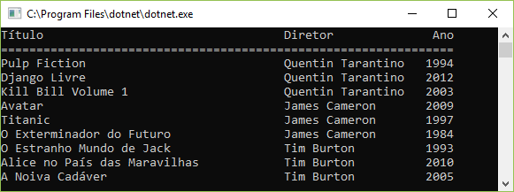
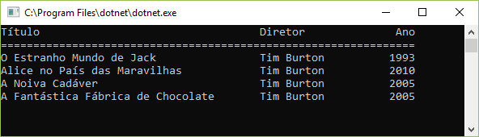

Consultar e manipular dados e objetos usando o LINQ

Comandos SQL são demorados para criar e
processar o resultado de uma consulta é um trabalho árduo.
A Consulta INtegrated Language, ou LINQ, foi criada para
torna muito fácil para programadores C# trabalhar com
fontes de dados. Esta seção aborda o LINQ e como
use-o.
Note que há muitos exemplos de programas em
esta seção, e as instruções LINQ podem ser um pouco
difícil de entender no começo. No entanto, lembre-se que
você pode baixar e executar todo o código de exemplo.

Aplicação de exemplo

A fim de fornecer um bom contexto para a exploração
de LINQ vamos desenvolver os Music TrackS
aplicativo usado anteriormente neste livro. Esta aplicação
permite o armazenamento de dados de faixa de música. Figura 4–15
mostra as classes no sistema. Note que no
momento em que não estamos usando um banco de dados para armazenar a classe
em formação. Mais tarde, vamos considerar como mapear isso
projeto em um banco de dados.

Nas versões anteriores do aplicativo, o
A classe MusicTrack continha uma string que dava
nome do artista que gravou a faixa. No novo
design, uma faixa de música contém uma referência a um
Objeto do artista que descreve o artista que registrou o
faixa. A Figura 4–15 mostra como isso funciona. Se um artista
registra mais de uma faixa (o que é muito provável), a
detalhes do artista só serão armazenados uma vez e referidos por
muitas instâncias do Music Track.

FIGURA 4-15 Projeto de classe de trilhas de música

O código a seguir mostra o código C # para as classes.

```csharp
class Diretor
{
    public string Nome { get; set; }
}

class Filme
{
    public Diretor Diretor { get; set; }
    public string Titulo { get; set; }
    public int Ano { get; set; }
}
```

Agora que você tem o design de classe para o
aplicação, a próxima coisa a fazer é criar alguns
dados de amostra. Isso deve ser feito de forma programática.
Testar um sistema inserindo dados à mão é um mau
idéia por várias razões. Primeiro, é muito
consumir. Em segundo lugar, quaisquer alterações no armazenamento de dados
design Vai significar que você provavelmente terá que entrar
todos os dados novamente. E terceiro, o ato de criar o
os dados de teste podem fornecer informações úteis sobre sua turma
desenhar.

LISTAGEM mostra código que cria alguns artistas
e faixas. Você pode aumentar a quantidade de dados de teste
adicionando mais artistas e títulos. Nesta versão todos
os artistas gravaram todas as faixas. Aleatório
gerador de números fornece cada faixa aleatória
comprimento no intervalo de 20 a 600 segundos. Observe que
porque o gerador de números aleatórios tem um fixo
valor da semente os comprimentos de cada faixa Serão os mesmos
cada vez que você executar o programa.

```csharp
static void Main(string[] args)
{
    List<Diretor> diretores = GetDiretores();
    List<Filme> filmes = GetFilmes();

    Console.WriteLine($"{"Título",-30}{"Diretor",-20}{"Ano",4}");
    Console.WriteLine(new string('=', 54));
    foreach (var filme in filmes)
    {
        Console.WriteLine($"{filme.Titulo, -30}{filme.Diretor.Nome, -20}{filme.Ano}");
    }

    Console.ReadKey();
}

private static List<Diretor> GetDiretores()
{
    return new List<Diretor>
    {
        new Diretor { Nome = "Quentin Tarantino" },
        new Diretor { Nome = "James Cameron" },
        new Diretor { Nome = "Tim Burton" }
    };
}

private static List<Filme> GetFilmes()
{
    return new List<Filme> {
        new Filme {
            Diretor = new Diretor { Nome = "Quentin Tarantino" },
            Titulo = "Pulp Fiction",
            Ano = 1994
        },
        ...
    };
}
```



Use um inicializador de objeto

Se você olhar o código na LISTAGEM, verá que
estamos usando a sintaxe do inicializador de objetos para criar novos
instâncias dos objetos de música e inicializar seus
valores ao mesmo tempo. Esta é uma Cié muito útil
recurso que permite inicializar objetos quando eles
são criados sem a necessidade de criar um construtor
método na classe que está sendo inicializada.
O código a seguir mostra como funciona. A declaração
cria e inicializa uma nova instância do Music Track.
Observe o uso de chaves ({e}) para delimitar os itens
que inicializam a instância e COMmas para separar
cada valor sendo usado para inicializar o objeto.

```csharp
Filme novoFilme = new Filme
{
    Diretor = new Diretor { Nome = "Tim Burton" },
    Titulo = "A Fantástica Fábrica de Chocolate",
    Ano = 2005
};
```

Você não precisa inicializar todos os elementos do
instância; quaisquer propriedades não inicializadas são definidas como suas
valores padrão (zero para um valor numérico e nulo para um
corda). As propriedades a serem inicializadas dessa maneira
todos devem ser membros públicos da classe.

Use um operador LINQ

Agora que você tem alguns dados pode usar operadores LINQ
para construir consultas e extrair resultados dos dados. o
código na LISTAGEM imprime os títulos de todos os
faixas que foram gravadas pelo artista com o nome
"Rob Miles". A primeira declaração usa uma consulta LINQ para
criar uma coleção enumerável de MusicTrack

referências chamadas selectedTracks que é então
enumerado pelo f o chegar a construção para imprimir
os resultados.

```csharp
IEnumerable<Filme> filmesSelecionados
    = from filme in filmes
        where filme.Diretor.Nome == "Tim Burton"
        select filme;

Imprimir(filmesSelecionados);
```



A consulta LINQ retorna um resultado IEnumerable
que é enumerado por uma construção foreach. Você
pode encontrar uma explicação de IEnumerable na Skill 2.4
na seção "IEnumerable". O “Create method-
com base em consultas LINQ ”tem mais detalhes sobre como
consulta é realmente implementada pelo código C #.
Use a palavra-chave var com o LINQ
A linguagem C # é "estaticamente digitada". O tipo de
objetos em um programa é determinado em tempo de compilação
e o compilador rejeita quaisquer ações que não são válidas.
Por exemplo, o código a seguir falha ao compilar
porque o compilador “não permite que uma string seja
subtraído de um número.

```csharp
string nome = "Steven Spielberg";
int ano = 1984;
int teste = ano - nome;
```

Isso proporciona mais confiança de que nossos programas são
correto antes que eles corram. A desvantagem é que você tem
para colocar no esforço de dar a cada variável um tipo quando
você declara isso. Na maior parte do tempo, entretanto,
compilador pode inferir o tipo a ser usado para qualquer dado
variável. A variável de nome no exemplo anterior
deve ser do tipo string, já que uma string está sendo
atribuído a ele. Pela mesma lógica, a variável idade
deve ser um int.

Você pode simplificar o código usando a palavra-chave var para
diga ao compilador para inferir o tipo da variável sendo
criado a partir do contexto em que a variável é usada.
O compilador irá definir uma variável de string chamada
nameVar em resposta à seguinte declaração:

```csharp
var nomeVar = "Steven Spielberg";
```

Note que isto não significa que o compilador
não pode detectar erros de compilação. As declarações em
LISTAGEM ainda não compila:

```csharp
var nomeVar = "Steven Spielberg";
var anoVar = 1984;
var testeVar = ano - nome;
```

A palavra-chave var é especialmente útil ao usar
LINQ. O resultado de uma consulta LINQ simples é um
coleção enumerável do tipo de elemento de dados mantido
na fonte de dados. A declaração a seguir mostra o
consulta da LISTAGEM.


```csharp
IEnumerable<Filme> selecionados =
from filme in filmes
where filme.Diretor.Nome == "Tim Burton"
select filme;
```


Para escrever esta declaração, você deve descobrir o tipo
de dados na coleção de faixas de música e, em seguida, use
esse tipo com IEnumerable. A palavra-chave var
torna este código muito mais fácil de escrever (veja a LISTAGEM
32).

```csharp
var selecionados =
from filme in filmes
where filme.Diretor.Nome == "Tim Burton"
select filme;
```


Existem algumas situações onde você não sabe
o tipo de uma variável Ao escrever o código. Mais tarde
esta seção você vai descobrir objetos que são criados
dinamicamente como o programa é executado e não tem nenhum tipo de
todos. Estes são chamados de tipos anônimos. O único jeito
código pode se referir a estes é pelo uso de variáveis do tipo
var.

Você pode usar o tipo var em todo o seu código
Se você gosta, mas por favor tenha cuidado. Uma declaração como
o seguinte não vai fazer você muito popular com
colegas programadores porque é impossível para eles
inferir o tipo de variável v Sem cavar no
código e descobrir que tipo é retornado pelo
Método de anúncio DoRe.

var v = DoRead();

Se você realmente quer usar var nessas situações, você
deve certificar-se de que você seleciona nomes de variáveis que
são adequadamente informativos, ou você pode inferir o tipo de
o item do código, como no seguinte
afirmações.


var nextPerson = DoReadPerson();
var newPerson = new Person();


Projeção LINQ

Você pode usar a operação de seleção no LINQ para
produzir uma versão filtrada de uma fonte de dados. Em
exemplos anteriores você descobriu todas as faixas
gravado por um artista em particular. Você pode criar outro
critérios de pesquisa, por exemplo, selecionando as faixas
com um certo título, ou faixas mais longas que um certo
comprimento.

O resultado de um select é uma coleção de referências
para objetos na coleção de dados de origem. Existe um
algumas razões Por que um programa pode não querer
funcionam assim. Primeiro, você pode não querer fornecer
referências aos objetos de dados reais nos dados
fonte. Em segundo lugar, você pode querer o resultado de uma consulta
para conter um subconjunto dos dados originais.

Você pode usar a projeção para fazer uma consulta para "projetar"
os dados na classe em novas instâncias de uma classe
criado apenas para conter os dados retornados pela consulta.

Vamos começar criando a classe chamada TrackDetai 1. s
que vai conter apenas o nome do artista e o título de um
faixa. Você vai usar isso para segurar o resultado da pesquisa
inquerir.


```csharp
class FilmeResumido
{
    public string Diretor { get; set; }
    public string Titulo { get; set; }
}
```


A consulta pode agora ser solicitada para criar uma nova
instância desta classe para manter o resultado de cada consulta.

```csharp
var selecionados2 =
from filme in filmes
where filme.Diretor.Nome == "Tim Burton"
select new FilmeResumido
{
    NomeDiretor = filme.Diretor.Nome,
    Titulo = filme.Titulo
};
```


Resultados de projeção como este são particularmente úteis
Quando você está usando a vinculação de dados para exibir
resultados para o usuário. Os valores no resultado da consulta podem ser
vinculado a itens a serem exibidos.

Tipos anônimos

Você pode remover a necessidade de criar uma classe para manter o
resultado de uma consulta de pesquisa, fazendo com que a consulta retorne
resultados de um tipo anônimo. Você pode ver como isso
agora está faltando no final do novo select
declaração.


```csharp
var selecionados3 =
from filme in filmes
where filme.Diretor.Nome == "Tim Burton"
select new // tipo anônimo: tipo da projeção não é necessário
{
    NomeDiretor = filme.Diretor.Nome,
    filme.Titulo
};
```


A consulta na LISTAGEM cria novas instâncias de
um tipo anônimo que contém apenas os itens de dados
caso a primeira propriedade no tipo é o nome do
artista que grava a faixa, e o segundo é o título de
a faixa. Para a primeira propriedade você realmente fornece
o nome do campo a ser criado no novo tipo.
Para a segunda propriedade, a propriedade é criada com
mesmo nome que a propriedade de origem, neste caso o
nome da propriedade será 1 e.

O item que é retornado por este queiy é um
coleção enumerável de instâncias de um tipo que tem
sem nome É um tipo anônimo. Isso significa que você
tem que usar uma referência var para se referir à consulta
resultado. Você pode percorrer a coleção neste
resultado como você faria com qualquer outro. Note que cada item
a coleção de faixas selecionada deve ser de 110W
referido usando var porque seu tipo não tem nome.
O código a seguir mostra como var é usado para cada item

Ao imprimir os resultados da consulta na LISTAGEM
4—34.


```csharp
foreach (var filme in selecionados3)
{
    Console.WriteLine($"{filme.Titulo,-40}{filme.NomeDiretor,-20}");
}
```


Observe que o uso de um tipo anônimo não
significa que o compilador é menos rigoroso quando
verificando a exatidão do código. Se o programa
tenta usar uma propriedade que não está presente no item,
por exemplo, se ele tentar obter a propriedade Length
a partir do resultado do quely, isso gera um erro em
tempo de compilação.

Junção LINQ

O design de classe usado até este ponto usa c #
referências para implementar as associações entre os
objetos no sistema. Em outras palavras, uma faixa de música
objeto contém uma referência ao objeto Artist que
representa o artista que gravou aquela faixa. Se vocês
armazenar seus dados em um banco de dados, no entanto, você não será
capaz de armazenar as associações dessa maneira.

Em vez disso, cada item no banco de dados terá um
ID exclusivo (sua chave primária) e objetos referentes a
esse objeto conterá esse valor de ID (uma chave estrangeira).
Em vez de uma referência a uma instância do Artista, o
O MusicTrack agora contém um campo ArtistID que
identifica o artista associado a essa faixa. Figura
4—16 mostra como esta associação é implementada.

olD: In!
3:53:25
Names‘rmn

FIGURA 4-16 Faixas de Música e Identificação do Artista

Esse design dificulta um pouco a pesquisa
para faixas de um artista em particular. O programa precisa
encontre o valor do ID para o artista com o nome sendo
procurou e, em seguida, procure por todas as faixas com isso
valor do id do artista. Felizmente, o LINQ fornece uma junção
operador que pode ser usado para juntar a saída de um LINQ
consulta para a entrada de outro.

A LISTAGEM mostra como isso funciona. A primeira consulta
seleciona o artista Com o nome "Rob Miles". Os resultados
dessa consulta são unidos à segunda consulta
que pesquisa a coleção de faixas de música para faixas
Com uma propriedade stid Arti que corresponda à do
artista encontrado pela primeira quely.

LISTAGEM Junção LINQ


```csharp
var filmesDeDiretores =
from diretor in diretores
where diretor.Nome == "Tim Burton"
join filme in filmes
on diretor.Id equals filme.DiretorId
select new
{
    NomeDiretor = diretor.Nome,
    filme.Titulo
};

foreach (var filme in filmesDeDiretores)
{
    Console.WriteLine($"{filme.Titulo,-40}{filme.NomeDiretor,-20}");
}
```


Grupo LINQ

Outro recurso útil do LINQ é a capacidade de agrupar

resultados de uma consulta para criar uma saída de resumo. Para
Por exemplo, você pode querer criar uma consulta para saber como
muitas faixas existem por cada artista na música
coleção.
A LISTAGEM mostra como fazer isso. O grupo
ação é dado o item de dados para agrupar por e o
propriedade por que é para ser agrupado. o
O resumo da trilha do artista contém uma entrada para cada
artista diferente. Cada um dos itens no resumo tem
uma propriedade Key, que é o valor que o item é
"Agrupados" ao redor. Você quer criar um grupo ao redor
artistas, então a chave é o valor do ID do Artista de cada
faixa. A propriedade Key do
O resumo da trilha do artista fornece o valor dessa chave.
Você pode usar comportamentos fornecidos por um objeto de resumo
para descobrir o conteúdo do resumo e
o método Count retorna o número de itens no
resumo. Você descobrirá mais resumo
comandos na discussão sobre o agregado
comandos mais adiante nesta seção.

LISTAGEM grupo LINQ


```csharp
var resumoDiretor =
from filme in filmes
group filme by filme.DiretorId
into resumoFilmeDiretor
select new
{
    ID = resumoFilmeDiretor.Key,
    Count = resumoFilmeDiretor.Count()
};
```


classes produzidas por esta consulta usando um foreach
loop como mostrado a seguir.


```csharp
Console.WriteLine($"{"DiretorId",-20}{"Quantidade",10}");
Console.WriteLine(new string('=', 30));
foreach (var item in resumoDiretor)
{
    Console.WriteLine($"{item.ID,-20}{item.Count,10}");
}
Console.WriteLine();
```


O problema Com esta consulta é que quando executá-lo
produz os resultados como mostrado a seguir. Ao invés de
gerando o nome do artista, o programa
exibe os valores do ID do Artista.


Artist: 0 Tracks recordedz5
Artist: 6 Tracks recorded: 5
Artist:12 Tracks recordedz5
Artist:18 Tracks recorded:5


Você pode consertar isso usando uma operação de junção
Isso irá extrair o nome do artista para uso na consulta.
A junção necessária é mostrada a seguir. Você pode então criar
o grupo digitou o nome do artista em vez do ID
para obter o resultado desejado.

```csharp
var resumoDiretorComNome =
from filme in filmes
join diretor in diretores
on filme.DiretorId equals diretor.Id
group filme by diretor.Nome
into resumoFilmeDiretor
select new
{
    ID = resumoFilmeDiretor.Key,
    Count = resumoFilmeDiretor.Count()
};

Console.WriteLine($"{"Nome Diretor",-20}{"Quantidade",10}");
Console.WriteLine(new string('=', 30));
foreach (var item in resumoDiretorComNome)
{
    Console.WriteLine($"{item.ID,-20}{item.Count,10}");
}
Console.WriteLine();
```

A saída desta consulta é mostrada aqui:


```
Nome Diretor        Quantidade
==============================
Quentin Tarantino            3
James Cameron                3
Tim Burton                   4
```


Note que esta é uma forte magia LINQ. Vale a pena
jogando com o código de amostra um pouco e examinando
a estrutura da consulta para ver o que está acontecendo.
LINQ Pegue e pule

Uma consulta LINQ normalmente retornará todos os itens
que se encontra. No entanto, isso pode ser mais itens que
seu programa quer. Por exemplo, você pode querer
mostre ao usuário a saída uma página por vez. Você pode
use take para dizer à consulta para pegar um número específico
de itens e o Skip para dizer uma consulta para pular um
determinado número de itens no resultado antes de tomar
o número solicitado.

O programa de amostra na LISTAGEM exibe todos
a música acompanha dez itens de cada vez. Ele usa um loop
que usa o Skip para ir progressivamente mais abaixo
o banco de dados toda vez que o loop é repetido. O laço
termina Quando a consulta LINQ retorna um vazio
coleção. O usuário pressiona uma tecla no final de cada
página para passar para a próxima página.

LISTAGEM LINQ tomar e pular


```csharp
int numeroPagina = 0;
int tamanhoPagina = 4;

while (true)
{
    // obtém informação sobre o filme
    var listaDeFilmes =
    from filme
        in filmes.Skip(numeroPagina * tamanhoPagina).Take(tamanhoPagina)
    join diretor in diretores
        on filme.DiretorId equals diretor.Id
    select new
    {
        NomeDiretor = diretor.Nome,
        filme.Titulo
    };
    // Sai do laço while se chegar ao final dos dados

    if (listaDeFilmes.Count() == 0)
        break;

    // Exibe os resultados da consulta
    foreach (var item in listaDeFilmes)
    {
        Console.WriteLine($"{item.NomeDiretor,-30}{item.Titulo,-30}");
    }
    Console.WriteLine("Tecle algo para continuar...");
    Console.ReadKey();
    // avança uma página
    numeroPagina++;
}
```

Comandos Agregados do LINQ

No contexto dos comandos LINQ, a palavra
agregado significa “reunir um certo número de
valores para criar um único resultado. ”Você pode usar
operadores sobre os resultados produzidos por
operações. Você já usou um agregado
operador em uma consulta LINQ. Você usou o Conde

operador na LISTAGEM para contar o número de trilhas
em um grupo extraído pelo artista. Isso forneceu a
número de faixas atribuídas a um determinado artista. Você
pode querer obter o comprimento total de todas as faixas
atribuído a um artista, e para isso você pode usar a Soma
operador agregado.
O parâmetro para o operador Sum é um lambda
expressão que o operador “mal usa em cada item
o grupo para obter o valor a ser adicionado ao total
soma para esse item. Para obter a soma do MusicTrack
comprimentos, a expressão lambda apenas retorna o valor
da propriedade Length para o item. LISTAGEM
mostra como isso funciona.

LISTAGEM Agregado LINQ


```csharp
var resumoDoDiretor =
from filme in filmes
join diretor in diretores 
on filme.DiretorId equals diretor.Id
group filme by diretor.Nome
into resumoDiretorFilme
select new
{
    Diretor = resumoDiretorFilme.Key,
    TotalMinutos = resumoDiretorFilme.Sum(x => x.Minutos)
};

Console.WriteLine($"{"Nome Diretor",-30}{"Total Minutos",20}");
Console.WriteLine(new string('=', 50));
foreach (var item in resumoDoDiretor)
{
    Console.WriteLine($"{item.Diretor,-30}{item.TotalMinutos,20}");
}
Console.WriteLine();
```


O resultado dessa consulta é uma coleção de
Objetos anônimos que contêm o nome do artista
e o comprimento total de todas as faixas gravadas por esse
artista. O programa produz a seguinte saída:


```
Nome Diretor                         Total Minutos
==================================================
Quentin Tarantino                              430
James Cameron                                  463
Tim Burton                                     261
```


Você pode usar Average, Max e Min para gerar
outros itens de informação agregada. Você também pode
crie seu próprio comportamento Agregado que será
chamado em cada item sucessivo no grupo e Will
gerar um único resultado agregado.
Criar consultas LINQ baseadas em método

A primeira consulta LINQ que você viu estava na LISTAGEM
como mostrado aqui.

```csharp
IEnumerable<Filme> filmesSelecionados
    = from filme in filmes
        where filme.Diretor.Nome == "Tim Burton"
        select filme;
```


A instrução de consulta usa a compreensão de consulta
sintaxe, que inclui os operadores de, em,
onde e selecione. O compilador usa isso para
gerar uma chamada para o método Where no
Coleção de faixas de música. Em outras palavras, o código
que é realmente criado para realizar a consulta é o
declaração abaixo:


```csharp
IEnumerable<Filme> filmesSelecionados
    = from filme in filmes
        where filme.Diretor.Nome == "Tim Burton"
        select filme;

Imprimir(filmesSelecionados);
```


O método Where aceita uma expressão lambda como
um parâmetro. Neste caso, a expressão lambda
aceita uma faixa de música como um parâmetro e retorna
Verdadeiro se a propriedade Name do elemento Artist em
o Mus i cTrack corresponde ao nome que está sendo
selecionado.

Você viu pela primeira vez expressões lambda na Habilidade 1.4,
“Crie e implemente eventos e retornos de chamada.”
expressão lambda é um pedaço de comportamento que pode ser
considerado como um objeto. Nesta situação o Onde
método está recebendo um pedaço de comportamento que o
método pode usar para determinar quais faixas selecionar.

Neste caso, o comportamento é “pegar uma pista e ver se o
nome do artista é Rob Miles. ”Você pode criar o seu próprio
consultas baseadas em método em vez de usar o LINQ
operadores. LISTAGEM mostra a consulta LINQ e o
comportamento baseado em método correspondente.

LISTAGEM Consulta baseada em método


```csharp
IEnumerable<Filme> filmesSelecionados
    = from filme in filmes
        where filme.Diretor.Nome == "Tim Burton"
        select filme;
```


Implementação baseada em método desta consulta


```csharp
IEnumerable<Filme> queryMetodo =
filmes.Where(filme => filme.Diretor.Nome == "James Cameron");
```


Programas podem usar os métodos LINQ que (e
executar consultas LINQ) em coleções de dados, como
listas e matrizes, e também em conexões de banco de dados.
Os métodos que implementam os comportamentos do LINQ
não são adicionados às classes que os utilizam. Em vez de
eles são implementados como métodos de extensão. Você pode
saiba mais sobre métodos de extensão na Habilidade 2.1, em
a seção “Métodos de extensão”.

Consultar dados usando consulta
sintaxe de compreensão

A frase “sintaxe de compreensão de consulta” refere-se a
a maneira que você pode construir consultas LINQ para usar o

Operadores C # fornecidos especificamente para expressar dados
consultas. A intenção é fazer as declarações C #
que se assemelham fortemente às consultas SQL que executam
a mesma função. Isso facilita para os desenvolvedores
familiarizado com a sintaxe SQL para usar o LINQ.

A LISTAGEM mostra uma consulta LINQ complexa que é
com base na consulta LINQ usada na LISTAGEM para
produzir um resumo dando a duração da música por
cada artista. Isso usa o operador orderby para pedir
a saída pelo nome do artista.

LISTAGEM Consulta completa


```csharp
var resumoDoDiretor =
from filme in filmes
join diretor in diretores 
on filme.DiretorId equals diretor.Id
group filme by diretor.Nome
into resumoDiretorFilme
select new
{
    Diretor = resumoDiretorFilme.Key,
    TotalMinutos = resumoDiretorFilme.Sum(x => x.Minutos)
};
```

A consulta SQL que corresponde a este LINQ é mostrada
abaixo:


```csharp
SELECT SUM([t0].[Minutos]) AS [TotalMinutos]
, [t1].[Nome] AS [Diretor]
FROM [Filme] AS [t0]
INNER JOIN [Diretor] AS [‘51]
ON [t0].[DiretorId] = [t1].[Id]
GROUP BY [t1].[Nome]
```


Esta saída foi gerada usando o LINQPad
aplicação que permite que os programadores criem LINQ
consultas e Ver o SQL e baseado em métodos
implementações. A edição padrão é muito
poderoso recurso para desenvolvedores e pode ser
baixado gratuitamente de http://www.linqpad.net/.
Selecione dados usando anonyn10us
tipos

Você viu pela primeira vez o uso de tipos anônimos no
Seção “Tipos anônimos”, anteriormente neste capítulo.
Os últimos exemplos de programas mostraram o uso de
tipos anônimos movendo-se da criação de valores que
resumir o conteúdo de um objeto de dados de origem
exemplo extraindo apenas o artista e título
informações de um valor do MusicTrack), para criar
tipos completamente novos que contêm dados do
banco de dados e os resultados dos operadores agregados.

É importante notar que você também pode criar
instâncias de tipo anônimas no SQL baseado em método
consultas. LISTAGEM mostra o método baseado em
implementação da consulta da LISTAGEM;
tipo anônimo é mostrado em negrito. Observe o uso de um
classe anônima intermediária que é usada para
implementar a junção entre as duas consultas e
gerar objetos que contenham artista e faixa
em formação.

LISTAGEM Tipos anônimos complexos


```csharp
var resumoArtistaPorMetodo =
filmes
.Join(diretores,
    filme => filme.DiretorId,
    diretor => diretor.Id,
    (filme, diretor) =>
    new
    {
        filme,
        diretor
    }
)
.GroupBy(temp => temp.diretor)
.Select(resumoDiretorFilme =>
new
{
    Diretor = resumoDiretorFilme.Key,
    TotalMinutos = resumoDiretorFilme.Sum(x => x.filme.Minutos)
});
Console.WriteLine($"{"Nome Diretor",-30}{"Total Minutos",20}");
Console.WriteLine(new string('=', 50));
foreach (var item in resumoDoDiretor)
{
    Console.WriteLine($"{item.Diretor,-30}{item.TotalMinutos,20}");
}
Console.WriteLine();
```


Forçar execução de uma consulta

O resultado de uma consulta LINQ é um item que pode ser
iterado. Nós usamos a construção foreach para
exibir os resultados das consultas. A avaliação real
de uma consulta LINQ normalmente só ocorre quando
programa começa a extrair resultados da consulta. este
é chamado de execução adiada. Se você quiser forçar o
execução de uma consulta, você pode usar o ToArray ()
método conforme mostrado na LISTAGEM. A consulta é
executada e o resultado retornado como uma matriz.

LISTAGEM Forçar execução de consulta


```csharp
var diretorFilmeQuery = 
from diretor in diretores
where diretor.Nome == "James Cameron"
join filme in filmes
on diretor.Id equals filme.DiretorId
select new
{
    NomeDiretor = diretor.Nome,
    filme.Titulo
};

var diretorFilmeArray = diretorFilmeQuery.ToArray();
foreach (var item in diretorFilmeArray)
{
    Console.WriteLine($"{item.NomeDiretor,-30}{item.Titulo,-30}");
}
Console.WriteLine();
```

Note que, no caso deste exemplo, o resultado será
resultado. O programa foi pausado logo após a
a variável Resultado do acompanhamento do artista foi definida como
resultado da consulta, e o depurador está mostrando o conteúdo
do artista Track Result.


[IMAGEM]

FIGURA 4-17 Resultados imediatos da consulta

Um resultado da consulta também fornece ToList e
ToDictionary métodos que forçará a execução de
a consulta e gerar um resultado imediato desse tipo.
Se uma consulta retornar um valor singleton (por exemplo,
resultado de uma operação de agregação, como soma ou
contagem) será imediatamente avaliado.
Leia, filtre, crie e modifique
estruturas de dados usando LINQ para
XML

Nesta seção, vamos investigar o LINQ para
Recursos XML que permitem usar o LINQ
construções para analisar documentos XML. As classes
que fornecem esses comportamentos estão no
Sistema. XML Namespace Linq.
Exemplo de Documento XML
O documento XML de amostra é mostrado a seguir. Contém
dois itens do Musictrack que são mantidos dentro de
Elemento Music Tracks. O texto da amostra
documento é armazenado em uma variável de cadeia chamada
XMLText.

```csharp
string xmlText =
"<Filmes>" +
    "<Filme>" +
        "<Diretor>Quentin Tarantino</Diretor>" +
        "<Titulo>Pulp Fiction</Titulo>" +
        "<Minutos>154</Minutos>" +
    "</Filme>" +
    "<Filme>" +
        "<Diretor>James Cameron</Diretor>" +
        "<Titulo>Avatar</Titulo>" +
        "<Minutos>162</Minutos>" +
    "</Filme>" +
"</Filmes>";
```

XDocument

Na seção anterior, "Consumir dados XML" você
Aprendi a consumir dados XML em um programa
usando a classe XMLDocument. Esta classe foi
substituído em versões posteriores do .NET (versão 3.5
em diante) pela classe XDocument, que permite a
uso de consultas LINQ para analisar arquivos XML.
Um programa pode criar uma instância do XDocument que
representa o documento anterior usando o Parse
método fornecido pela classe XDocument como mostrado
Aqui.


```csharp
XDocument documentoFilmes = XDocument.Parse(xmlText);
```


O formato das consultas LINQ é um pouco diferente
Ao trabalhar com XML. Isso porque a fonte

da consulta é um conjunto filtrado de entradas XML do
documento Fonte. A LISTAGEM mostra como isso funciona.
A consulta seleciona todos os elementos "Music Track" de
o documento de origem. O resultado da consulta é um
enumeração de itens do XElement que foram
extraído do documento. A classe XElement é
um desenvolvimento da classe XMLElement que inclui
Comportamentos XML. O programa usa um foreach
construção para trabalhar através da coleção de
Resultados XElement, extraindo os valores de texto necessários.

LISTAGEM: Ler XML com LINQ


```csharp
IEnumerable<XElement> filmesSelecionados2 =
from filme in documentoFilmes.Descendants("Filme")
select filme;
foreach (XElement item in filmesSelecionados2)
{
    Console.WriteLine("Diretor: {0}, Título: {1} ",
        item.Element("Diretor").FirstNode,
        item.Element("Titulo").FirstNode);
}
```


Filtrar dados XML com o LINQ para XML

O programa na LISTAGEM exibe todo o
conteúdo do documento XML. Um programa pode
realizar filtragem na consulta, adicionando um onde
operador, assim como com o LIN Q que vimos antes.
A LISTAGEM mostra como isso funciona. Note que o
Onde a operação tem que extrair o valor de dados de
o elemento para que ele possa realizar a comparação.

LISTAGEM: Filtrar XML com LINQ

```csharp
filmesSelecionados2 =
from filme in documentoFilmes.Descendants("Filme")
where (string)filme.Element("Diretor") == "Quentin Tarantino"
select filme;
foreach (XElement item in filmesSelecionados2)
{
    Console.WriteLine("Diretor: {0}, Título: {1} ",
        item.Element("Diretor").FirstNode,
        item.Element("Titulo").FirstNode);
}
Console.WriteLine();
```


As consultas LINQ que temos visto até agora têm
foi expressa usando a compreensão de consulta. Isto é
possível, no entanto, expressar a mesma pergunta no
forma de uma consulta baseada em método. Os descendentes
método retorna um objeto que fornece o Onde
comportamento. O código a seguir mostra a consulta na LISTAGEM
44 implementado como uma consulta baseada em método.


```csharp
filmesSelecionados2 =
from filme in documentoFilmes.Descendants("Filme")
.Where(elemento =>(string)elemento.Element("Diretor")
    == "Quentin Tarantino")
select filme;
foreach (XElement item in filmesSelecionados2)
{
    Console.WriteLine("Diretor: {0}, Título: {1} ",
        item.Element("Diretor").FirstNode,
        item.Element("Titulo").FirstNode);
}
```


Crie XML com o LINQ para XML

Os recursos LINQ to XML incluem uma maneira muito fácil de
criar documentos XML. O código na LISTAGEM
cria um documento exatamente como o XML de amostra para
esta seção. Note que o arranjo do
chamadas de construtor para cada item XElement espelham
estrutura do documento.

LISTAGEM Criar XML com LINQ

```csharp
XElement filmesXML = new XElement("Filmes",
    new List<XElement>
    {
        new XElement ("Filme" ,
            new XElement ("Diretor" , "Steven Spielberg"),
            new XElement ("Titulo" , "A Lista de Schindler")),
        new XElement ("Filme",
            new XElement ("Diretor" , "Christopher Nolan"),
            new XElement ("Titulo" , "Batman: O Cavaleiro das Trevas"))
    }
);
```


Modificar dados com o LINQ para XML

A classe XElement fornece métodos que podem ser
usado para modificar o conteúdo de um determinado elemento XML.
O programa na LISTAGEM cria um que
identifica todos os itens da faixa de música que têm
título "meu caminho" e, em seguida, usa o ReplaceWith
método sobre os dados do título no elemento para mudar o
título para o título correto, que é "meu caminho".

LISTAGEM Modificar XML com LINQ

```csharp
filmesSelecionados2 =
from filme in documentoFilmes.Descendants("Filme")
select filme;
foreach (XElement item in filmesSelecionados2)
{
    item.Element("Titulo").FirstNode.ReplaceWith("Novo nó");
}

foreach (XElement item in filmesSelecionados2)
{
    Console.WriteLine("Diretor: {0}, Título: {1} ",
        item.Element("Diretor").FirstNode,
        item.Element("Titulo").FirstNode);
}
Console.WriteLine();
```


Como você viu Ao criar um novo documento XML,
um XElement pode conter uma coleção de outros
elementos para construir a estrutura da árvore de um XML
documento. Você pode adicionar programaticamente e
remover elementos para alterar a estrutura do XML
documento.

Suponha que você decida adicionar um novo elemento de dados
para Musictrack. Você quer armazenar o "gênero" do
código na LISTAGEM encontra todos os itens em nossa
dados de amostra que estão faltando um elemento de estilo e, em seguida,
adiciona o elemento ao item.

LISTAGEM: Adicionar XML com LINQ


```csharp
var filmesSelecionados3 =
from filme in documentoFilmes.Descendants("Filme")
select filme;
foreach (XElement item in filmesSelecionados3)
{
    item.Add(new XElement("Genero", "Drama"));
}

foreach (XElement item in filmesSelecionados3)
{
    Console.WriteLine("Diretor: {0}, Título: {1}, Gênero: {2} ",
        item.Element("Diretor").FirstNode,
        item.Element("Titulo").FirstNode,
        item.Element("Genero").FirstNode);
}
Console.WriteLine();
```


