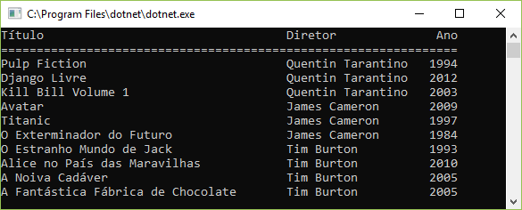
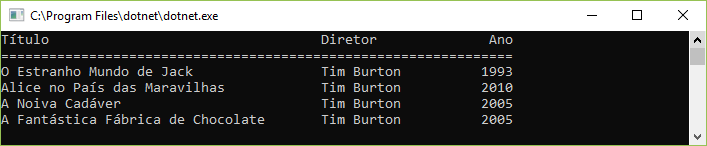
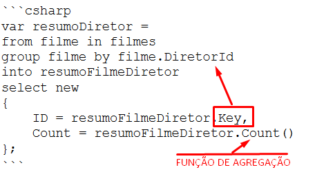
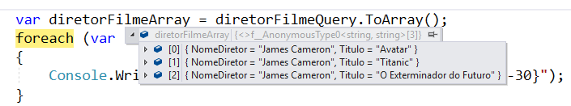

# Consultar e manipular dados e objetos usando o LINQ

A Consulta Integrada à Linguagem, ou LINQ, foi criada para
tornar fácil o trabalho de programadores C# com
fontes de dados.

Vamos trabalhar com um programa que vai obter dados a partir
de 2 listas:

- 1 lista com dados de filmes
- 1 lista com diretores de filmes

O código a seguir mostra o código C# para as classes que representam o diretor e o filme.

```csharp
class Diretor
{
    public string Nome { get; set; }
}

class Filme
{
    public Diretor Diretor { get; set; }
    public string Titulo { get; set; }
    public int Ano { get; set; }
}
```

Além dos dados de testes, também disponibilizamos no início do curso
dois métodos `GetDiretores()` e `GetFilmes()`, que fornecem as listas de diretores e de filmes:

```csharp
private static List<Diretor> GetDiretores()
{
    return new List<Diretor>
    {
        new Diretor { Nome = "Quentin Tarantino" },
        new Diretor { Nome = "James Cameron" },
        new Diretor { Nome = "Tim Burton" }
    };
}

private static List<Filme> GetFilmes()
{
    return new List<Filme> {
        new Filme {
            Diretor = new Diretor { Nome = "Quentin Tarantino" },
            Titulo = "Pulp Fiction",
            Ano = 1994
        },
        ...
    };
}
```

Vamos começar nosso programa criando uma instância para cada lista:

```csharp
static void Main(string[] args)
{
    List<Diretor> diretores = GetDiretores();
    List<Filme> filmes = GetFilmes();
}
```

Mas qual o conteúdo dessas listas? Vamos criar um laço para pegar cada um dos
elementos de `filmes` e imprimir seus dados no console:

```csharp
static void Main(string[] args)
{
    List<Diretor> diretores = GetDiretores();
    List<Filme> filmes = GetFilmes();

    Console.WriteLine($"{"Título",-30}{"Diretor",-20}{"Ano",4}");
    Console.WriteLine(new string('=', 54));
    foreach (var filme in filmes)
    {
        Console.WriteLine($"{filme.Titulo, -30}{filme.Diretor.Nome, -20}{filme.Ano}");
    }

    Console.ReadKey();
}
```

Rodando a aplicação, temos nosso primeiro resultado:


Mas note que esse código que imprime os filmes poderá ser utilizado depois, então podemos
evitar a repetição desse algoritmo extraindo-o para um novo método `Imprimir()`::

```csharp
static void Main(string[] args)
{
    List<Diretor> diretores = GetDiretores();
    List<Filme> filmes = GetFilmes();

    Imprimir(filmes);

    Console.ReadKey();
}

private static void Imprimir(List<Filme> filmes)
{
    Console.WriteLine($"{"Título",-40}{"Diretor",-20}{"Ano",4}");
    Console.WriteLine(new string('=', 64));
    foreach (var filme in filmes)
    {
        Console.WriteLine($"{filme.Titulo,-40}{filme.Diretor.Nome,-20}{filme.Ano}");
    }
    Console.WriteLine();
}
```


**Use um inicializador de objeto**

Se você olhar o código na LISTAGEM, verá que
estamos usando a sintaxe do inicializador de objetos para criar novos
instâncias dos objetos de filme e inicializar seus
valores ao mesmo tempo:

```csharp
new Filme {
    DiretorId = 1,
    Diretor = new Diretor { Nome = "Quentin Tarantino" },
    Titulo = "Pulp Fiction",
    Ano = 1994,
    Minutos = 2 * 60 + 34
}
```

Este é um recurso muito útil
que permite inicializar objetos quando eles
são criados sem a necessidade de criar um construtor
na classe que está sendo inicializada.

O código a seguir mostra como funciona. A declaração
cria e inicializa uma nova instância do Filme.
Observe o uso de chaves ( { e } ) para delimitar os itens
que inicializam a instância e vírgulas para separar
cada valor sendo usado para inicializar o objeto.

```csharp
Filme novoFilme = new Filme
{
    Diretor = new Diretor { Nome = "Tim Burton" },
    Titulo = "A Fantástica Fábrica de Chocolate",
    Ano = 2005
};
filmes.Add(novoFilme);
```

Você não precisa inicializar todos os elementos do
instância: quaisquer propriedades não inicializadas são definidas com seus
valores-padrão (zero para um valor numérico e nulo para strings).

(Todas as propriedades a serem inicializadas dessa maneira
devem ser membros públicos da classe)

**Usando um operador LINQ**

Agora que você tem alguns dados, pode começar a usar operadores LINQ
para construir consultas e extrair resultados desses dados.

Vamos declarar uma variável `filmesSelecionados` para armazenar nossa consulta.
Inicialmente, a consulta contém TODOS os elementos da lista de filmes:

```csharp
IEnumerable<Filme> filmesSelecionados = filmes;
Imprimir(filmesSelecionados);
```

Como resultado, temos:



Agora faremos uma pequena alteração: em vez de pegar o resultado diretamente da lista
de filmes, vamos **criar uma consulta** sobre essa lista de filmes. Como seria
essa consulta, se você estivesse trabalhando com SQL Server?

```
SELECT f.*
FROM filmes AS f
WHERE NomeDiretor = 'Tim Burton'
```

Onde:

- A cláusula SELECT define a "PROJEÇÃO", isto é, quais colunas devem ser retornadas no resultado
- A cláusula FROM define a origem dos dados
- A letra "f" representa o ALIAS para a tabela de filmes
- A cláusula WHERE filtra os dados

As consultas LINQ usam uma sintaxe parecida:

```csharp
IEnumerable<Filme> filmesSelecionados
    = select f from filmes as f;
```

Porém, uma consulta LINQ sempre deve começar pela cláusula FROM:

```csharp
IEnumerable<Filme> filmesSelecionados
    = from filmes as f select f;
```

Além disso, o ALIAS da tabela de filmes tem a sintaxe "[alias] in [dados]":

```csharp
IEnumerable<Filme> filmesSelecionados
    = from f in filmes select f;
Imprimir(filmesSelecionados);
```

Rodando a aplicação, teremos o mesmo resultado.

O próximo passo é filtrar pelo nome do diretor do filme.

Podemos acessar as propriedades de um filme através do seu alias,
que funciona como uma variável temporária dentro da consulta.

Vamos introduzir a cláusula `where` para filtrar pelos filmes de um
diretor:

```csharp
IEnumerable<Filme> filmesSelecionados
    = from filme in filmes
        where filme.Diretor.Nome == "Tim Burton"
        select filme;

Imprimir(filmesSelecionados);
```

Rodando a aplicação, temos agora o resultado filtrado:



O código na LISTAGEM imprime os títulos de todos os
filmes que foram gravadas pelo diretor com o nome
"Tim Burton". A primeira declaração usa uma consulta LINQ para
criar uma coleção enumerável de Filme.

A consulta LINQ retornou um resultado IEnumerable, e por isso 
ele pode ser enumerado por uma construção foreach.

**Usando a palavra-chave var para tipos implícitos com o LINQ**

A linguagem C# é "estaticamente tipada". Por isso, o tipo de
objetos em um programa é determinado em tempo de compilação
e o compilador rejeita quaisquer ações que não forem válidas.

Na consulta, declaramos a variável como `IEnumerable<Filme>`,
mas você pode simplificar o código usando a palavra-chave `var` para
dizer ao compilador para inferir o tipo da variável sendo
criado a partir do contexto em que a variável é usada.

A palavra-chave var é especialmente útil quando trabalhamos com
LINQ. O resultado de uma consulta LINQ simples é um
coleção enumerável do tipo de elemento de dados mantido
na fonte de dados. A declaração a seguir mostra nossa
consulta atual.


```csharp
IEnumerable<Filme> selecionados =
from filme in filmes
where filme.Diretor.Nome == "Tim Burton"
select filme;
```


Para escrever esta declaração, você deve primeiro descobrir o tipo
de dados na coleção de filmes e, em seguida, usar
esse tipo com `IEnumerable<Filme>`.

A palavra-chave `var` torna este código mais fácil de escrever:

```csharp
var selecionados =
from filme in filmes
where filme.Diretor.Nome == "Tim Burton"
select filme;
```

**Projeção LINQ**

No exemplo acima, a consulta produz o mesmo objeto contido na
coleção de origem (filmes).

Mas você pode usar a operação de seleção no LINQ para
produzir uma versão *transformada* de cada objeto da fonte de dados. 
Em vez de retornar um Filme, você pode retornar um outro tipo de objeto
usando os dados de Filme.

O nome desse processo de tranformar os dados da saída é **projeção LINQ**.

Vamos demonstrar isso criando a classe chamada FilmeResumido,
que vai conter apenas o nome do diretor e o título de um
filme.

```csharp
class FilmeResumido
{
    public string Diretor { get; set; }
    public string Titulo { get; set; }
}
```

Essa será a classe usada na nossa **projeção de dados** com a cláusula select da consulta LINQ.

```csharp
var selecionados2 =
from filme in filmes
where filme.Diretor.Nome == "Tim Burton"
select new FilmeResumido
{
    NomeDiretor = filme.Diretor.Nome,
    Titulo = filme.Titulo
};
```

Esse tipo de consulta é bem comum quando temos "dados brutos" em banco
de dados, mas queremos exibir ao usuário os dados "transformados", num formato amigável.

**Tipos anônimos**

Observe a cláusula de "projeção" (select) desta consulta LINQ

```csharp
var selecionados2 =
from ...
select new FilmeResumido
{
    NomeDiretor = filme.Diretor.Nome,
    Titulo = filme.Titulo
};
```

Nesse caso, fomos obrigados a criar um tipo novo, a classe FilmeResumido, para
armazenar os dados do filme resumido.

Mas muitas vezes isso não é obrigatório. Vamos remover o nome da classe FilmeResumido no instanciamento do select:

```csharp
var selecionados2 =
from ...
select new // tipo anônimo: tipo da projeção não é obrigatório
{
    NomeDiretor = filme.Diretor.Nome,
    Titulo = filme.Titulo
};
```

A consulta acima cria novas instâncias de
um **tipo anônimo** que contém apenas os itens de dados:
- nome do diretor que dirigiu o filme
- título do filme.

Observe que, para a primeira propriedade, você forneceu
o nome do campo a ser criado no novo tipo (NomeDiretor). Já a
segunda propriedade foi criada com o
**mesmo nome** que a propriedade de origem.
Quando não há redefinição de nome, o compilador presume o nome
da propriedade `Titulo`.

O resultado retornado por esta query é uma
coleção enumerável de instâncias de um tipo sem nome.
É um **tipo anônimo**. Isso significa que você
tem que usar uma **referência var** para se referir ao 
resultado da consulta.

Você pode percorrer a coleção neste
resultado como você faria com qualquer outro. Note que cada item
da coleção de filmes selecionada deve ser agora
referido usando **var** na instrução `foreach` porque seu tipo não tem nome.
O código a seguir mostra como `var` é usado para cada item:


```csharp
foreach (var filme in selecionados3)
{
    Console.WriteLine($"{filme.Titulo,-40}{filme.NomeDiretor,-20}");
}
```


Observe que, mesmo quando o tipo é anônimo, não
significa que o compilador vai deixar de ser rigoroso com a
exatidão do código.

Enquanto digitamos, as 2 propriedades (`Titulo` e `NomeDiretor`) são
verificadas pelo compilador. Não podemos inventar e utilizar aqui
propriedades que não existem no `select` da consulta LINQ anterior.

**Junção LINQ**

Até aqui, trabalhamos com a classe `Filme`, que possui como propriedade
o `Diretor`, que é uma instância da classe `Diretor`:

```csharp
class Filme
{
    public Diretor Diretor { get; set; }
    public string Titulo { get; set; }
}
```

No entanto, se você está trabalhando com um banco de dados, 
muitas vezes você não pode armazenar as associações dessa maneira.

Em vez disso, cada item no banco de dados terá um
ID exclusivo (sua chave primária) e objetos referentes a
esse objeto conterá esse valor de ID (uma chave estrangeira).

Em vez de uma *referência* a uma instância do `Diretor`, o
o `Filme` agora contém um campo `DiretorId` que
identifica o diretor associado a esse filme.

```csharp
class Filme
{
    public int DiretorId { get; set; }
    public string Titulo { get; set; }
}

```

Esse design dificulta um pouco a pesquisa
para filmes de um diretor em particular. O programa precisa
encontrar o valor do ID para o diretor com um determinado nome sendo
procurado e, em seguida, procurar por todos os filmes com esse
valor de `DiretorId`.

Felizmente, o LINQ fornece um **operador de junção** (`join`)
que pode ser usado para *juntar* a saída de uma consulta LINQ
com a *entrada* de outra consulta.

A cláusula *join* da consulta é definida pela sintaxe:

```csharp
join b in [OrigemB]
on b.CampoB equals a.CampoA
```

Aplicando em nossa consulta, a `OrigemB` é a lista `diretores`,
e os campos `CampoA` e `CampoB` são `filme.DiretorId` e
`diretor.Id`, respectivamente. Esses campos são as propriedades
onde é realizada a *junção*.

```csharp
var filmesDeDiretores =
from diretor in diretores
where diretor.Nome == "Tim Burton"
join filme in filmes
on diretor.Id equals filme.DiretorId
select new
{
    NomeDiretor = diretor.Nome,
    filme.Titulo
};

foreach (var filme in filmesDeDiretores)
{
    Console.WriteLine($"{filme.Titulo,-40}{filme.NomeDiretor,-20}");
}
```

Note que a cláusula `select` agora foi modificada, de forma
que cada propriedade do objeto anônimo de saída (projeção LINQ)
vem de uma entidade diferente do **join**:

```csharp
select new
{
    NomeDiretor = diretor.Nome,
    filme.Titulo
};
```

**Grupo LINQ**

Outro recurso útil do LINQ é a capacidade de agrupar

Imagine uma nova consulta, descrita em português como:

> ***"Traga-me o Id de cada diretor, ao lado da quantidade de filmes
> dirigidos desse diretor"***

Como implementar essa consulta com LINQ?

Primeiro temos que lembrar que cada elemento da nossa consulta atual
representa *um filme individual* de um diretor.

Precisamos modificar a consulta para que cada linha do resultado
seja um **agrupamento** para um único diretor. 
 
Para isso, temos que usar a sintaxe de agrupamento da **cláusula group** do LINQ:

Primeiro, começamos com a origem de dados, contendo todos os dados de filmes.

```csharp
var resumoDiretor =
from filme in filmes
```

Em seguida, agrupamos os filmes por *id de diretor*, e armazenamos
o resultado do agrupamento em uma *variável de consulta* chamada
`resumoFilmeDiretor`:

```csharp
var resumoDiretor =
from filme in filmes
group filme by filme.DiretorId
into resumoFilmeDiretor
```

Essa variável `resumoFilmeDiretor` é visível apenas dentro da consulta.

O próximo passo é fornecer informações para as 2 colunas de dados
que precisamos:

- O Id do diretor
- A quantidade de filmes desse diretor

```csharp
var resumoDiretor =
from filme in filmes
group filme by filme.DiretorId
into resumoFilmeDiretor
select new
{
    ID = resumoFilmeDiretor.Key,
    Count = resumoFilmeDiretor.Count()
};
```

Para obtermos esse resultado, foi necessário obter a *chave (key)*
do agrupamento, e invocar uma das *funções de agregação (Count)* 
que estão presentes quando realizamos um agrupamento.




Para listar os resultados desta última consulta, vamos percorrer
o resultado da consulta com a instrução `foreach`:

```csharp
Console.WriteLine($"{"DiretorId",-20}{"Quantidade",10}");
Console.WriteLine(new string('=', 30));
foreach (var item in resumoDiretor)
{
    Console.WriteLine($"{item.ID,-20}{item.Count,10}");
}
Console.WriteLine();
```

Note que cada elemento contém o Id do diretor e a quantidade de filmes.

```
DiretorId           Quantidade
==============================
1                            3
2                            3
3                            3
```

Mas um relatório com o id do diretor não é muito útil, porque não sabemos quem é cada diretor.

Você pode consertar isso introduzindo na consulta uma *operação de junção*.
Isso irá extrair o nome do diretor para uso na consulta.

A junção necessária é mostrada a seguir. Você pode então criar
o grupo com o nome do diretor em vez do ID
para obter o resultado desejado.

```csharp
var resumoDiretorComNome =
from filme in filmes
join diretor in diretores
on filme.DiretorId equals diretor.Id
group filme by diretor.Nome
into resumoFilmeDiretor
select new
{
    ID = resumoFilmeDiretor.Key,
    Count = resumoFilmeDiretor.Count()
};

Console.WriteLine($"{"Nome Diretor",-20}{"Quantidade",10}");
Console.WriteLine(new string('=', 30));
foreach (var item in resumoDiretorComNome)
{
    Console.WriteLine($"{item.ID,-20}{item.Count,10}");
}
Console.WriteLine();
```

A saída desta consulta é mostrada aqui:


```
Nome Diretor        Quantidade
==============================
Quentin Tarantino            3
James Cameron                3
Tim Burton                   4
```

**LINQ Take e Skip**

Uma consulta LINQ normalmente retornará todos os itens
que se encontra. No entanto, esse tipo de consulta pode 
trazer mais itens que seu programa precisa.

Por exemplo, você pode desenvolver uma consulta para um relatório 
enorme a ser exibido numa página web, e querer mostrar ao usuário
o conteúdo de **uma página por vez**.

Você pode usar o método `Take()` para dizer à consulta para pegar
um número  específico de itens e o `Skip()` para dizer uma consulta
para pular um determinado número de itens no resultado antes de obter
a quantidade solicitada.

Geralmente, os métodos Take() e Skip() são usados em algoritmos de
paginação. A sintaxe simplificada de uma consulta LINQ com paginação é:

```csharp
from d in dados
dados.Skip(NUMERO_DA_PAGINA * TAMANHO_PAGINA).Take(TAMANHO_PAGINA)
```

Podemos agora aplicar essa paginação em nossa consulta:

```csharp
int numeroPagina = 0;
int tamanhoPagina = 4;

while (true)
{
    // obtém informação sobre o filme
    var listaDeFilmes =
    from filme
        in filmes.Skip(numeroPagina * tamanhoPagina).Take(tamanhoPagina)
    join diretor in diretores
        on filme.DiretorId equals diretor.Id
    select new
    {
        NomeDiretor = diretor.Nome,
        filme.Titulo
    };
    // Sai do laço while se chegar ao final dos dados

    if (listaDeFilmes.Count() == 0)
        break;

    // Exibe os resultados da consulta
    foreach (var item in listaDeFilmes)
    {
        Console.WriteLine($"{item.NomeDiretor,-30}{item.Titulo,-30}");
    }
    Console.WriteLine("Tecle algo para continuar...");
    Console.ReadKey();
    // avança uma página
    numeroPagina++;
}
```

O programa exibe dez itens de filmes cada vez.
Ele usa um loop que usa o método `Skip()` para ir trazendo
progressivamente mais páginas a partir do banco de dados 
toda vez que o loop é repetido.

O laço termina quando a consulta LINQ retorna uma coleção vazia.
O usuário pressiona uma tecla no final de cada página para passar
para a próxima página.

**Comandos Agregados do LINQ**

No contexto dos comandos LINQ, a palavra
**agregado** significa "reunir um certo número de
valores para criar um único resultado"

Você pode usar operadores sobre os resultados produzidos por
operações. Você já usou um operador agregado
em uma consulta LINQ. Você usou o
operador `Count()` para contar o número de filmes
em um grupo extraído pelo diretor.

Isso forneceu o número de filmes atribuídos a um determinado diretor.
Você pode querer obter o comprimento total de todas os filmes
atribuído a um diretor, e para isso você pode usar o
operador agregado `Sum()`.

```csharp
select new
{
    Diretor = resumoDiretorFilme.Key,
    TotalMinutos = resumoDiretorFilme.Sum(x => x.Minutos)
};
```

O parâmetro para o operador `Sum` é uma *expressão lambda*
que o grupo usa para obter o valor a ser adicionado à soma total
para esse item.

Para obter a soma das durações dos filmes, a expressão lambda apenas 
retorna o valor da propriedade `Length` para o item.

**LISTAGEM LINQ Agregado**

```csharp
var resumoDoDiretor =
from filme in filmes
join diretor in diretores 
on filme.DiretorId equals diretor.Id
group filme by diretor.Nome
into resumoDiretorFilme
select new
{
    Diretor = resumoDiretorFilme.Key,
    TotalMinutos = resumoDiretorFilme.Sum(x => x.Minutos)
};

Console.WriteLine($"{"Nome Diretor",-30}{"Total Minutos",20}");
Console.WriteLine(new string('=', 50));
foreach (var item in resumoDoDiretor)
{
    Console.WriteLine($"{item.Diretor,-30}{item.TotalMinutos,20}");
}
Console.WriteLine();
```


O resultado dessa consulta é uma coleção de
Objetos anônimos que contêm o nome do diretor
e o comprimento total de todas os filmes dirigidos por esse
diretor. O programa produz a seguinte saída:


```
Nome Diretor                         Total Minutos
==================================================
Quentin Tarantino                              430
James Cameron                                  463
Tim Burton                                     261
```


Você pode usar `Average`, `Max` e `Min` para gerar
outros itens de informação agregada:

```csharp
var resumoDoDiretor2 =
from filme in filmes
join diretor in diretores
on filme.DiretorId equals diretor.Id
group filme by diretor.Nome
into resumoDiretorFilme
select new
{
    Diretor = resumoDiretorFilme.Key,
    TotalMinutos = resumoDiretorFilme.Sum(x => x.Minutos),
    MediaMinutos = (int)resumoDiretorFilme.Average(x => x.Minutos),
    MinMinutos = resumoDiretorFilme.Min(x => x.Minutos),
    MaxMinutos = resumoDiretorFilme.Max(x => x.Minutos)
};

Console.WriteLine($"{"Nome Diretor",-30}{"Total",10}{"Média",10}{"Mínimo",10}{"Máximo",10}");
Console.WriteLine(new string('=', 70));
foreach (var item in resumoDoDiretor2)
{
    Console.WriteLine($"{item.Diretor,-30}{item.TotalMinutos,10}{item.MediaMinutos,10}{item.MinMinutos,10}{item.MaxMinutos,10}");
}
Console.WriteLine();

```

O que dá o resultado:

```
Nome Diretor                       Total     Média    Mínimo    Máximo
======================================================================
Quentin Tarantino                    430       143       111       165
James Cameron                        463       154       107       194
Tim Burton                           261        87        76       108
```

**Criar consultas LINQ baseadas em método**

A primeira consulta LINQ que você viu era assim:

```csharp
IEnumerable<Filme> filmesSelecionados
    = from filme in filmes
        where filme.Diretor.Nome == "Tim Burton"
        select filme;
```


Essa instrução usa um tipo de **sintaxe de consulta**,
que inclui os operadores `from`, `in`,
`where` e `select`. O compilador usa isso para
gerar uma chamada para o método `Where()` na
coleção de `filmes`. Em outras palavras, o código
que é **realmente criado** para realizar a consulta é a
declaração abaixo:


```csharp
IEnumerable<Filme> filmesSelecionados =
    filmes.Where(filme => filme.Diretor.Nome == "Tim Burton")
        select filme;

Imprimir(filmesSelecionados);
```


O método `Where()` aceita uma expressão lambda como
um parâmetro. Neste caso, a expressão lambda
aceita uma filme como um parâmetro e retorna
Verdadeiro se a propriedade `Nome` do elemento `Diretor` no 
`Filme` corresponde ao nome que está sendo selecionado.

O método `Where()` está recebendo **um pedaço** de comportamento
que o método pode usar para determinar quais filmes selecionar.

Neste caso, o comportamento é "pegar um filme e ver se o
nome do diretor é Tim Burton".

Você pode criar a sua própria **consulta baseada em método** em vez 
de usar **operadores LINQ**.

Abaixo vemos uma consulta LINQ e o
comportamento baseado em método correspondente.

```csharp
IEnumerable<Filme> filmesSelecionados
    = from filme in filmes
        where filme.Diretor.Nome == "James Cameron"
        select filme;
```


Implementação baseada em método desta consulta:


```csharp
IEnumerable<Filme> queryMetodo =
filmes.Where(filme => filme.Diretor.Nome == "James Cameron");
```


Programas podem usar os métodos LINQ (e
executar consultas LINQ) em coleções de dados, como
listas e matrizes, e também em conexões de banco de dados.

> Importante: Os métodos que implementam os comportamentos do LINQ
> não são adicionados às classes que os utilizam (ex.: Listas, Dicionários, etc.). 
> Em vez disso, eles são implementados como **métodos de extensão**.


**Consultar dados usando sintaxe de consulta**

A frase “sintaxe de consulta” refere-se a
a maneira que você pode construir consultas LINQ para usar 
operadores C# fornecidos especificamente para expressar 
consultas de dados (from, join, select, etc).

A intenção é fazer as declarações C#
que se assemelham às consultas SQL que executam
a mesma função (como no SQL Server). Isso facilita a vida dos
desenvolvedores familiarizado com a sintaxe SQL para usar o LINQ.

A listagem abaixo mostra uma consulta LINQ complexa que é
feita com base na consulta LINQ usada na listagem para
produzir um resumo, retornando a duração da filme por
cada diretor. Ela usa o operador `orderby` para solicitar
a saída pelo nome do diretor.

**LISTAGEM Consulta complexa**

```csharp
var resumoDoDiretor =
from filme in filmes
join diretor in diretores 
on filme.DiretorId equals diretor.Id
group filme by diretor.Nome
into resumoDiretorFilme
select new
{
    Diretor = resumoDiretorFilme.Key,
    TotalMinutos = resumoDiretorFilme.Sum(x => x.Minutos)
};
```

A consulta SQL que corresponde a este LINQ é mostrada
abaixo:


```csharp
SELECT SUM([t0].[Minutos]) AS [TotalMinutos]
, [t1].[Nome] AS [Diretor]
FROM [Filme] AS [t0]
INNER JOIN [Diretor] AS [‘51]
ON [t0].[DiretorId] = [t1].[Id]
GROUP BY [t1].[Nome]
```


Esta saída foi gerada usando um aplicativo bem útil chamado **LINQPad**.
Ele que permite que os programadores criem consultas LINQ
e ver o SQL gerado a partir do LINQ. o LINQPad pode ser
baixado gratuitamente de http://www.linqpad.net/.

**Selecione dados usando anônimos tipos**

Já vimos como trabalhar com “Tipos anônimos”, anteriormente.

Os últimos exemplos de programas mostraram o uso de
tipos anônimos desde a criação de valores que
resumir o conteúdo de um objeto de dados de origem
exemplo, extraindo apenas informações do diretor e título
de um Filme, para criar tipos completamente novos que contêm 
dados do banco de dados e os resultados dos operadores agregados.

É importante notar que você também pode criar
instâncias de tipo anônimas no SQL baseado em método
consultas. A listagem mostra o método **baseado em
implementação da consulta** da listagem. O tipo anônimo é 
mostrado em negrito. Observe o uso de um
classe anônima intermediária que é usada para
implementar a junção entre as duas consultas e
gerar objetos que contenham diretor e filme 
em formação.

**LISTAGEM Tipos anônimos complexos**


```csharp
var resumoDiretorPorMetodo =
filmes
.Join(diretores,
    filme => filme.DiretorId,
    diretor => diretor.Id,
    (filme, diretor) =>
    new
    {
        filme,
        diretor
    }
)
.GroupBy(temp => temp.diretor)
.Select(resumoDiretorFilme =>
new
{
    Diretor = resumoDiretorFilme.Key,
    TotalMinutos = resumoDiretorFilme.Sum(x => x.filme.Minutos)
});
Console.WriteLine($"{"Nome Diretor",-30}{"Total Minutos",20}");
Console.WriteLine(new string('=', 50));
foreach (var item in resumoDoDiretor)
{
    Console.WriteLine($"{item.Diretor,-30}{item.TotalMinutos,20}");
}
Console.WriteLine();
```


**Forçar a execução de uma consulta**

Quando criamos uma consulta LINQ, seu resultado pode ser
percorrido com uma instrução `foreach`.

Porém, a avaliação **real** de uma consulta LINQ normalmente 
só ocorre quando o programa **começa a extrair** resultados da consulta.

Isto é chamado de **execução adiada**. Se você quiser forçar o
execução de uma consulta, você pode usar o método `ToArray()`
conforme mostrado abaixo.

```csharp
var diretorFilmeQuery = 
from diretor in diretores
where diretor.Nome == "James Cameron"
join filme in filmes
on diretor.Id equals filme.DiretorId
select new
{
    NomeDiretor = diretor.Nome,
    filme.Titulo
};

var diretorFilmeArray = diretorFilmeQuery.ToArray();
foreach (var item in diretorFilmeArray)
{
    Console.WriteLine($"{item.NomeDiretor,-30}{item.Titulo,-30}");
}
Console.WriteLine();
```

A consulta é executada e o resultado retornado como **uma matriz**.

O programa foi pausado logo após a variável Resultado do acompanhamento 
do diretor foi definida como resultado da consulta, e o depurador está 
mostrando o conteúdo da variável `diretorFilme`.





```
James Cameron                 Avatar
James Cameron                 Titanic
James Cameron                 O Exterminador do Futuro
```


**FIGURA Resultados imediatos da consulta**

O resultado da consulta também fornece os métodos `ToList()` e
`ToDictionary()`, que **forçarão a execução** da consulta e gerar 
um **resultado imediato** desse tipo.

Se uma consulta retornar um valor *singleton* (por exemplo,
resultado de uma operação de agregação, como soma ou
contagem), esse valor **será imediatamente avaliado**.

**Ler, filtrar, criar e modificar estruturas de dados usando LINQ para
XML**

Vamos começar a investigar recursos que permitem usar construções do LINQ
para analisar documentos XML.

As classes que fornecem esses comportamentos estão no namespace 
Sistem.XML.Linq.

**Exemplo de Documento XML**

```csharp
string xmlText =
"<Filmes>" +
    "<Filme>" +
        "<Diretor>Quentin Tarantino</Diretor>" +
        "<Titulo>Pulp Fiction</Titulo>" +
        "<Minutos>154</Minutos>" +
    "</Filme>" +
    "<Filme>" +
        "<Diretor>James Cameron</Diretor>" +
        "<Titulo>Avatar</Titulo>" +
        "<Minutos>162</Minutos>" +
    "</Filme>" +
"</Filmes>";
```

Este documento XML contém dois itens do `Filme` que são mantidos dentro
de elemento `Filmes`. O texto do documento é armazenado em 
uma variável string chamada `xmlText`.

**Ler XML com LINQ para XML e XDocument**

Anteriormente neste curso, você
aprendeu a consumir dados XML em um programa
usando a classe `XMLDocument`.

Esta classe foi **substituída** em versões posteriores do .NET 
(versão 3.5 em diante) pela classe `XDocument`, que permite o
uso de consultas LINQ para analisar arquivos XML.

Um programa pode criar uma instância do `XDocument` que
representa o documento anterior usando o método `Parse`
fornecido pela classe XDocument como mostrado
aqui:

```csharp
XDocument documentoFilmes = XDocument.Parse(xmlText);
```

O formato das consultas LINQ é um pouco diferente
quando trabalhamos com XML. Isso porque a fonte
da consulta é um conjunto filtrado de **entradas XML** do
documento de origem:

```csharp
IEnumerable<XElement> filmesSelecionados2 =
from filme in documentoFilmes.Descendants("Filme")
select filme;
foreach (XElement item in filmesSelecionados2)
{
    Console.WriteLine("Diretor: {0}, Título: {1} ",
        item.Element("Diretor").FirstNode,
        item.Element("Titulo").FirstNode);
}
```

A listagem mostra como isso funciona. A consulta seleciona todos 
os elementos "Filme" de
o documento de origem. O resultado da consulta é um
enumeração de itens do `XElement` que foram
extraído do documento.

A classe XElement é um desenvolvimento da classe XMLElement que inclui
Comportamentos XML. O programa usa uma construção foreach
para trabalhar através da coleção de resultados `XElement`, extraindo 
os valores de texto necessários.


**Filtrar dados XML com o LINQ para XML**

O programa na LISTAGEM exibe todo o
conteúdo do documento XML. Um programa pode
realizar filtragem na consulta, adicionando um
operador `where`, assim como com o LINQ que vimos antes.

A listagem mostra como isso funciona. Note que o 
operador `Where` tem que extrair o valor de dados do
elemento para que ele possa realizar a comparação.

```csharp
filmesSelecionados2 =
from filme in documentoFilmes.Descendants("Filme")
where (string)filme.Element("Diretor") == "Quentin Tarantino"
select filme;
foreach (XElement item in filmesSelecionados2)
{
    Console.WriteLine("Diretor: {0}, Título: {1} ",
        item.Element("Diretor").FirstNode,
        item.Element("Titulo").FirstNode);
}
Console.WriteLine();
```


As consultas LINQ que temos visto até agora foram criadas 
usando a compreensão de consulta. Isto é
possível, no entanto, expressar a mesma query na
forma de uma consulta baseada em método.

O método `Descendants` retorna um objeto que fornece o 
comportamento `Where`. O código a seguir mostra a consulta na listagem
implementado como uma *consulta baseada em método*.


```csharp
filmesSelecionados2 =
from filme in documentoFilmes.Descendants("Filme")
.Where(elemento =>(string)elemento.Element("Diretor")
    == "Quentin Tarantino")
select filme;
foreach (XElement item in filmesSelecionados2)
{
    Console.WriteLine("Diretor: {0}, Título: {1} ",
        item.Element("Diretor").FirstNode,
        item.Element("Titulo").FirstNode);
}
```


**Crie XML com o LINQ para XML**

Os recursos LINQ to XML incluem uma maneira muito fácil de
criar documentos XML. O código a seguir cria um documento exatamente 
como o XML de amostra para esta seção. Note que o arranjo do
chamadas de construtor para cada item `XElement` espelham
estrutura do documento.

**LISTAGEM Criar XML com LINQ**

```csharp
XElement filmesXML = new XElement("Filmes",
    new List<XElement>
    {
        new XElement ("Filme" ,
            new XElement ("Diretor" , "Steven Spielberg"),
            new XElement ("Titulo" , "A Lista de Schindler")),
        new XElement ("Filme",
            new XElement ("Diretor" , "Christopher Nolan"),
            new XElement ("Titulo" , "Batman: O Cavaleiro das Trevas"))
    }
);
```


**Modificar dados com o LINQ para XML**

A classe `XElement` fornece métodos que podem ser
usado para modificar o conteúdo de um determinado elemento XML.
O programa na listagem cria uma consulta que identifica todos os itens 
do filme que têm título "meu caminho" e, em seguida, usa o método 
`ReplaceWith` sobre os dados do título no elemento para mudar o título
para um outro título.

**LISTAGEM Modificar XML com LINQ**

```csharp
filmesSelecionados2 =
from filme in documentoFilmes.Descendants("Filme")
select filme;
foreach (XElement item in filmesSelecionados2)
{
    item.Element("Titulo").FirstNode.ReplaceWith("Novo nó");
}

foreach (XElement item in filmesSelecionados2)
{
    Console.WriteLine("Diretor: {0}, Título: {1} ",
        item.Element("Diretor").FirstNode,
        item.Element("Titulo").FirstNode);
}
Console.WriteLine();
```


Como você viu Ao criar um novo documento XML,
um `XElement` pode conter uma coleção de outros
elementos para construir a estrutura da árvore de um documento XML.

Você pode adicionar e remover programaticamente elementos para 
alterar a estrutura do documento XML.

Suponha que você decida adicionar um novo elemento de dados
para `Filme`. Você quer armazenar o "gênero" do filme para todos os
elementos `Filme`.

**LISTAGEM: Adicionando XML com LINQ**


```csharp
var filmesSelecionados3 =
from filme in documentoFilmes.Descendants("Filme")
select filme;
foreach (XElement item in filmesSelecionados3)
{
    item.Add(new XElement("Genero", "Drama"));
}

foreach (XElement item in filmesSelecionados3)
{
    Console.WriteLine("Diretor: {0}, Título: {1}, Gênero: {2} ",
        item.Element("Diretor").FirstNode,
        item.Element("Titulo").FirstNode,
        item.Element("Genero").FirstNode);
}
Console.WriteLine();
```


